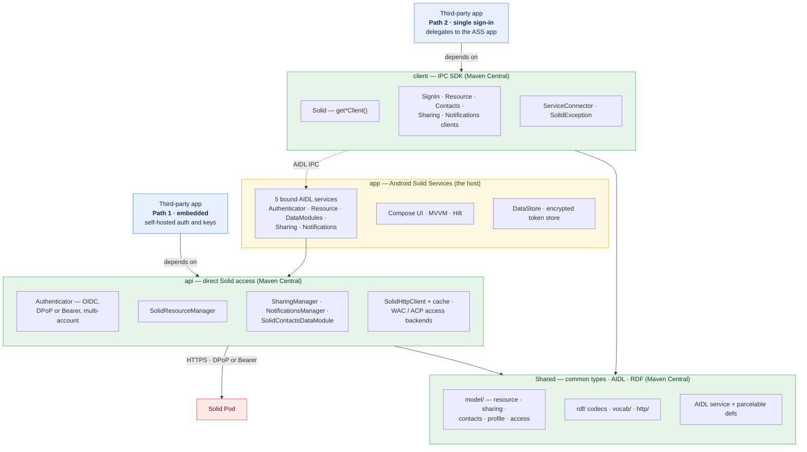
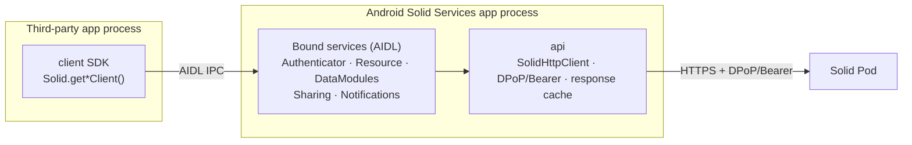

# Architecture

## Modules and Integration Paths

Four Gradle modules in a layered chain. `Shared` holds the common types; `api` and `client` both build
on it; the `app` (the host) bundles both. Three of the four — `Shared`, `api`, and `client` — are
published to Maven Central, so a third-party app can integrate along **either of two paths**:

- **Path 1 — embedded (`api`):** depend on `api` and reach the Solid pod **directly**, performing your
  own login and signing every request in-process. Self-contained — no ASS app needs to be installed,
  but your app manages its own credentials and keys.
- **Path 2 — single sign-in (`client`):** depend on `client` and delegate over **AIDL IPC** to the
  installed ASS app, which holds the credentials and talks to the pod for you. One shared login across
  every Solid app on the device, and no token handling in your app.

Both paths run the **same `api` engine** against the pod — the difference is *where* it runs: in the
third-party app's own process (Path 1), or inside the ASS app's process behind AIDL (Path 2). `api`
and `client` each depend on `Shared`; the `app` depends on both.

Package roots: `app` → `com.erfangholami.androidsolidservices`, with `…api`, `…client`, and
`…shared` for the three libraries.

---

## IPC: How Apps Communicate

Apps that take the single-sign-in path (`client`) **never talk directly to the Solid pod**. They bind to one of the AIDL services in the ASS app, which uses the `api` module to reach the pod over authenticated HTTPS. (Apps on the embedded path link `api` and make these same calls in-process.)

Each `client` entry point binds to its matching bound service:

| `client` entry point             | Bound service             | Responsibility                          |
|----------------------------------|---------------------------|-----------------------------------------|
| `Solid.getSignInClient()`        | `ASSAuthenticatorService` | Login, access grants                    |
| `Solid.getResourceClient()`      | `ASSResourceService`      | CRUD on pod resources                   |
| `Solid.getContactsDataModule()`  | `SolidDataModulesService` | Contacts, address books                 |
| `Solid.getSharingClient()`       | `ASSSharingService`       | Shares, access grants *(0.5.0)*         |
| `Solid.getNotificationsClient()` | `ASSNotificationsService` | LDN inbox *(0.5.0)*                      |

Each service is an Android **bound service**. The client libraries expose `Flow<Boolean>` connection state so apps can react to connect/disconnect events in real time.

AIDL interface definitions (both parcelable types and service contracts) live in `Shared/src/main/aidl/`.

---

## Authentication: OpenID Connect (DPoP or Bearer)

The auth flow uses the **AppAuth** library (`net.openid:appauth`) for the OpenID Connect code exchange. Token binding is **negotiated** from the provider's discovery document: if it advertises DPoP (Demonstration of Proof-of-Possession) support via `dpop_signing_alg_values_supported`, ASS uses DPoP; otherwise it falls back to standard **Bearer** tokens.

1. User enters their WebID or selects an OpenID provider.
2. ASS resolves the OIDC issuer from the WebID document.
3. A browser intent opens the provider's login page.
4. The provider redirects back to ASS with an authorization code.
5. ASS exchanges the code for access + refresh tokens.
6. Every subsequent pod request carries an `Authorization: <DPoP|Bearer> <token>` header; when DPoP was negotiated, a freshly signed DPoP proof is attached as well — binding the token to the request and preventing replay.

When DPoP is in effect, each account has its **own DPoP key pair** in the Android Keystore. Multi-account state (profiles, tokens) is persisted with **DataStore**, **encrypted at rest** (AES-256-GCM via an Android Keystore key). Login can use either dynamic client registration or a hosted **Solid-OIDC Client ID Document** (`clientId`). Token refresh is nonce-aware (per-origin DPoP nonces, retry on `use_dpop_nonce`) and resilient — a recoverable failure no longer forces a re-login.

---

## Module Breakdown

### Shared (`com.erfangholami.androidsolidservices.shared`)

Common types shared across all modules. Published implicitly as a transitive dependency. Since 0.5.0
it is organized into intent-based packages (`model/`, `rdf/`, `http/`, `result/`, `error/`, `util/`,
`vocab/`), and its public API exposes only plain types — a `String` content-type and a `SolidHeaders`
value type rather than okhttp / titanium-json-ld types (the JSON-LD codec is an internal dependency).

| Area              | Contents                                                                                              |
|-------------------|-------------------------------------------------------------------------------------------------------|
| Resource model    | `Resource` → `RDFResource` / `NonRDFResource` → `SolidRDFResource` / `SolidNonRDFResource` / `SolidContainer` (with `size` / `createdTime` / `lastModified` accessors since 0.5.0) |
| HTTP types        | `SolidNetworkResponse<T>` (sealed: `Success`, `Error`, `Exception`), `SolidHeaders`, `HTTPConstants` |
| Data module types | `AddressBook`, `AddressBookList`, `Contact`, `FullContact`, `NewContact`, `FullGroup`                 |
| Sharing types     | `GivenShare`, `ReceivedShare`, `ShareMode`, `ShareReceiver`, `AccessGrant`, `CatalogEntry`, `ShareNotification`, `ShareRequest` (0.5.0) |
| Patch type        | `N3Patch` — type-safe DSL and diff factory for [Solid N3 Patch](https://solidproject.org/TR/protocol#n3-patch) documents |
| Vocabulary        | `LDP`, `VCARD`, `ACL`, `ACP`, `OWL`, `DC`, `RDFS`, `Solid` constants                                  |
| AIDL parcelables  | Parcelable wrappers for cross-process data transfer (all definitions consolidated here)               |

### api (`com.erfangholami.androidsolidservices.api`)

Direct Solid server communication. Used internally by the ASS app and available as a standalone library.

| Class                                                               | Role                                       |
|---------------------------------------------------------------------|--------------------------------------------|
| `Authenticator` / `AuthenticatorImplementation`                     | OIDC auth (DPoP or Bearer), multi-account, Client ID Document |
| `SolidResourceManager` / `SolidResourceManagerImplementation`       | CRUD on pod resources (+ `head`/`patch`/`createInContainer`) |
| `SolidContactsDataModule` / `SolidContactsDataModuleImplementation` | Contacts data module                       |
| `SharingManager` / `SharingManagerImplementation`                   | Resource sharing — WAC/ACP grants, index, share links (0.5.0) |
| `NotificationsManager` / `NotificationsManagerImplementation`       | LDN inbox — offers, requests, accept/reject (0.5.0) |
| `AccessBackend` (`WacBackend` / `AcpBackend`)                       | Internal access-control writers behind sharing (0.5.0) |
| `SolidHttpClient` / `SolidResponseCache`                            | OkHttp-based Solid HTTP client + in-memory response cache (0.5.0) |
| `DPoPGenerator`                                                     | Signs DPoP proof JWTs when the provider supports DPoP (per-account keys) |

### client (`com.erfangholami.androidsolidservices.client`)

IPC client library. No direct pod access — all calls are proxied through the ASS app.

| Class                      | Role                                                                               |
|----------------------------|------------------------------------------------------------------------------------|
| `Solid`                    | Entry point: `getSignInClient()`, `getResourceClient()`, `getContactsDataModule()`, `getSharingClient()`, `getNotificationsClient()` |
| `SolidSignInClient`        | Auth IPC client                                                                    |
| `SolidResourceClient`      | Resource CRUD IPC client (`head`/`patch`/`update(ifMatch)` since 0.5.0)            |
| `SolidContactsDataModule`  | Contacts IPC client                                                                |
| `SolidSharingClient`       | Resource sharing IPC client (0.5.0)                                                |
| `SolidNotificationsClient` | LDN inbox IPC client (0.5.0)                                                       |
| `ServiceConnector`         | Shared, self-healing AIDL bind/callback plumbing (0.5.0)                           |
| `SolidException` hierarchy | Typed exceptions for all failure modes                                             |

### app (`com.erfangholami.androidsolidservices`)

The host application. Users interact with this; third-party apps bind to its services.

| Area           | Technology                                                                 |
|----------------|----------------------------------------------------------------------------|
| UI             | Jetpack Compose, Navigation Compose                                        |
| Architecture   | MVVM, ViewModel, Kotlin StateFlow                                          |
| DI             | Hilt                                                                       |
| Services       | `ASSAuthenticatorService`, `ASSResourceService`, `SolidDataModulesService`, `ASSSharingService`, `ASSNotificationsService` |
| Persistence    | DataStore + Protocol Buffers (access grants, profiles); token store encrypted at rest (AES-256-GCM, Android Keystore) |
| Auth           | `net.openid:appauth` (OIDC) + DPoP or Bearer tokens                        |
| Solid protocol | Custom `SolidHttpClient` (OkHttp-based; Inrupt Java Client removed)        |

---

## Technology Summary

| Technology                     | Version / Notes                              |
|--------------------------------|----------------------------------------------|
| Kotlin                         | Coroutines, Flow, serialization              |
| Jetpack Compose                | UI — no XML views                            |
| Hilt                           | Dependency injection (app module only)       |
| AIDL                           | Cross-process communication                  |
| AppAuth (`net.openid:appauth`) | OpenID Connect                               |
| `SolidHttpClient`              | Custom OkHttp-based Solid HTTP client (replaces Inrupt Java Client SDK); in-memory response cache since 0.5.0 |
| Titanium JSON-LD               | RDF, JSON-LD parsing (internal `implementation` dependency — off the public API surface since 0.5.0) |
| DataStore                      | Local persistence (Preferences + a kotlinx.serialization JSON `Serializer`); token store encrypted at rest (AES-256-GCM, Android Keystore) since 0.5.0 |
| kotlinx.serialization          | JSON serialization (replaced Gson in v0.3.0) |
| API Validator plugin           | Binary API compatibility enforcement via `.api` files |
| Min SDK                        | 26 (Android 8.0)                             |
| Target / Compile SDK           | 33 / 36                                      |
| JVM target                     | 17                                           |
