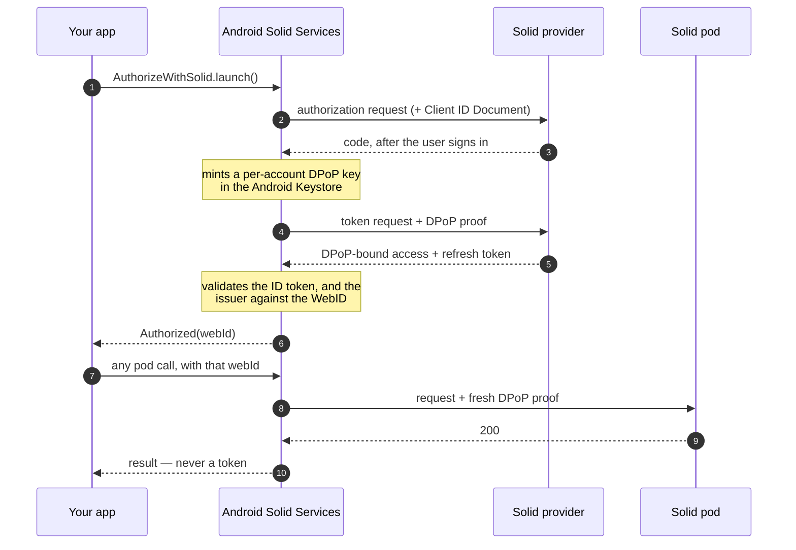

# Sign in & accounts

Everything else on a pod needs a WebID to act as. This is how you get one, keep it, and deal with
a device that holds more than one.

On the `client` path you write no authentication code at all — the host app owns the login. On the
`api` path you run the OIDC flow yourself and the library handles DPoP, nonces and refresh.

## What you can build

- Sign-in that reuses a session the user already has, with no second password prompt.
- An account switcher, when someone keeps work and personal pods apart.
- A session that survives app restarts and token expiry without re-prompting.
- A sign-out that actually ends the relationship rather than just forgetting locally.

## Setup

=== "Client (via Android Solid Services)"

    --8<-- "dependency-client.md"

    ```kotlin
    import com.erfangholami.androidsolidservices.client.sdk.Solid

    val signIn = Solid.getSignInClient(context)
    ```

=== "API (direct to the pod)"

    --8<-- "dependency-api.md"

    ```kotlin
    import com.erfangholami.androidsolidservices.api.auth.Authenticator

    val authenticator = Authenticator.getInstance(context)
    ```

    ```kotlin title="build.gradle.kts"
    android {
        defaultConfig {
            manifestPlaceholders["appAuthRedirectScheme"] = "com.example.yourapp"
        }
    }
    ```

## Recipes

### Sign a user in

=== "Client (via Android Solid Services)"

    ```{ .kotlin .annotate }
    class MainActivity : ComponentActivity() {

        // Register during creation, not in a click handler. (1)!
        private val authorize = registerForActivityResult(AuthorizeWithSolid()) { result ->
            when (result) {
                is SolidSignInResult.Authorized -> onSignedIn(result.webId)
                SolidSignInResult.Dismissed     -> showMessage("Sign-in cancelled")
                is SolidSignInResult.Failed     -> showError(result.exception)
            }
        }

        private fun startSignIn() = authorize.launch(Unit)
    }
    ```

    1. Android requires result contracts to be registered before the activity reaches `STARTED`.
       Registering later throws.

    Your app launches the picker from its own foreground, which is why sign-in needs no permission
    at all — not even the overlay permission earlier versions asked for.

=== "API (direct to the pod)"

    ```kotlin
    val (intent, error) = authenticator.createAuthenticationIntent(
        oidcIssuer = "https://solidcommunity.net",
        appName = "Your App",
        redirectUri = "com.example.yourapp:/callback",
        clientId = "https://yourapp.example/client.jsonld",   // (1)!
    )
    if (intent != null) login.launch(intent)

    // …then, in the result callback:
    val webId = authenticator.submitAuthorizationResponse(result.data)
    ```

    1. Optional but strongly recommended — see the warning below.

    !!! danger "Dynamic registration expires"
        Omit `clientId` and the library registers a client dynamically with the provider. Inrupt
        discards those after 24 hours, and **the refresh token dies with the registration** — which
        looks exactly like a session that mysteriously drops once a day. Hosting a
        [Client ID Document](../reference/client-id-document.md) and passing its URL as `clientId`
        is the fix.

### Check whether you are already signed in

Do this before showing a sign-in button, or you will prompt someone who is already authorized.

=== "Client (via Android Solid Services)"

    ```kotlin
    val account = signIn.getAccount(webId)      // null when this app is not authorized
    if (account != null) proceed(account.webId) else startSignIn()
    ```

=== "API (direct to the pod)"

    ```kotlin
    if (authenticator.isUserAuthorized()) {
        proceed(authenticator.getActiveWebId())
    } else {
        startSignIn()
    }
    ```

### Wait for the connection before calling

On the `client` path every service is a bound service. Collect its state and wait for `true`:

```kotlin
signIn.authServiceConnectionState().first { connected -> connected }
```

Skipping this is the most common cause of a first call failing on a cold start — the binding has
not finished. The `api` path has nothing to wait for.

### Handle several accounts

=== "Client (via Android Solid Services)"

    The host app owns the account list. Your app receives whichever WebID the user picked at
    authorization, and passes it to every call.

    ```kotlin
    val account = signIn.getAccount(webId) ?: return
    resources.readStream(account.webId, uri)     // routed to that account's session
    ```

=== "API (direct to the pod)"

    ```kotlin
    val all = authenticator.getAllLoggedInProfiles()
    authenticator.setActiveWebId(all.first().webId?.getIdentifier().orEmpty())

    // Observe instead of polling:
    authenticator.loggedInProfilesFlow.collect { profiles -> render(profiles) }
    authenticator.expiredProfilesFlow.collect { expired -> promptReauth(expired) }
    ```

### Notice an expired session

Expiry is a **state**, not an error — a profile whose refresh has run out stays in the list,
flagged, so you can prompt for re-authentication instead of silently losing the user's data. While
a profile is expired, every request made for it fails fast with `SolidError.NotAuthenticated`
(`SolidNotLoggedInException` over IPC) and leaves only a breadcrumb in telemetry, so an expired
account does not flood a crash reporter.

```kotlin
authenticator.expiredProfilesFlow.collect { expired ->
    expired.forEach { promptReauth(it) }
}
```

### Sign out

=== "Client (via Android Solid Services)"

    ```kotlin
    signIn.disconnectFromSolid(webId) { revoked ->
        if (revoked) returnToSignIn()
    }
    ```

    This revokes **your app's** grant. The user stays signed in to Android Solid Services, and
    their other apps are unaffected.

=== "API (direct to the pod)"

    ```kotlin
    val (intent, error) = authenticator.getTerminationSessionIntent(
        webId = webId,
        logoutRedirectUrl = "com.example.yourapp:/logout",
    )
    if (intent != null) logout.launch(intent)

    authenticator.removeProfile(webId)     // drops the local session too
    ```

## How it flows



## Errors you'll hit

| What you see | Why | What to do |
|---|---|---|
| `SolidNotLoggedInException` | no usable session for that WebID, including one that expired | send the user through sign-in again |
| `SolidAppNotFoundException` | the host app is not installed | prompt to [install it](../start/install-app.md), or use `api` |
| `SolidServiceConnectionException` | called before the binding completed | collect the connection-state flow first |
| A session that dies about once a day | dynamic registration expired — Inrupt drops them after 24h | host a [Client ID Document](../reference/client-id-document.md) and pass `clientId` |
| `401` that re-authenticating does not fix | the pod wants a DPoP nonce, not a new login | already handled — the library retries with the nonce |
| Everything 403s after switching account | calls are still using the previous WebID | pass the new WebID; 403 rather than 401 is the tell |

## Under the hood

Authentication is where a person's identity — a WebID — becomes a set of credentials this library
can put on an HTTP request. It implements Solid-OIDC: the user authenticates at their own identity
provider in a browser tab, the library exchanges the result for tokens, and every subsequent
request carries an access token plus a DPoP proof bound to a key that never leaves the device. The
library holds several such identities at once and keeps each one's tokens, keys and profile
separate.

This is also the part of the library that has cost the most real sessions, so the failure
behaviour in §5 is the section worth reading twice.

<details class="info" markdown id="pod-shape">
<summary>Pod shape</summary>


Authentication writes nothing to a pod. It **reads** the WebID profile document, and what it needs
from it is small:

```turtle
@prefix solid: <http://www.w3.org/ns/solid/terms#> .
@prefix pim:   <http://www.w3.org/ns/pim/space#> .
@prefix foaf:  <http://xmlns.com/foaf/0.1/> .

<https://alice.solidcommunity.net/profile/card#me>
    solid:oidcIssuer  <https://solidcommunity.net> ;
    pim:storage       <https://alice.solidcommunity.net/> ;
    foaf:name         "Alice" .
```

`solid:oidcIssuer` is the only field authentication strictly requires: it names who is allowed to
issue tokens for this WebID, and it is what makes a WebID self-describing rather than tied to a
directory. `pim:storage` is read at the same time because every later feature needs it.

The profile document is fetched with `readPublic` — an unauthenticated read — when it belongs to
somebody else. That is not an optimisation: several identity providers answer an *authenticated*
read of a third party's profile with 401, so an authenticated fetch is strictly worse.

Everything else lives on the device: tokens, the DPoP key pair in the Android Keystore, the
account list, and each session's error state. The library never publishes a device's key or its
session state to the pod.

</details>

<details class="info" markdown id="public-surface">
<summary>Public surface</summary>


`Authenticator` (`api/src/main/java/com/erfangholami/androidsolidservices/api/auth/Authenticator.kt`)
is the whole surface. It initialises **asynchronously**, which shapes how it must be called.

| Member | Notes |
|---|---|
| `activeWebIdFlow`, `activeAccountFlow` | The current identity |
| `loggedInProfilesFlow`, `expiredProfilesFlow` | The two lists an account switcher needs |
| `getActiveWebId()` | **Suspending**, and it awaits initialisation. This is the one to call first. |
| `isUserAuthorized()` | Synchronous, and only accurate *after* initialisation has completed |
| `createAuthenticationIntentWithOidcIssuer(clientName, issuer, redirectUri)` | Suspending; returns the browser intent plus an optional error |
| `submitAuthorizationResponse(intent)` | Completes the code exchange, returns the WebID |
| `setActiveWebId`, `removeProfile`, `removeAllProfiles` | Switching and sign-out |
| `hasValidToken(webId, forceRefresh)` | From [SolidSession]: ensures a usable token, reports availability |
| `authHeaders(webId, method, uri)` | From [SolidSession]: the token plus a DPoP proof bound to this request |
| `updateDPoPNonce(webId, uri, nonce)` | Stores a server-issued DPoP nonce per origin |

Consumers should not call `isUserAuthorized()` synchronously as an initial value at startup: it
returns `false` before initialisation completes, which routes a signed-in user to a login screen.
Await `getActiveWebId()` first.

</details>

<details class="info" markdown id="how-it-flows">
<summary>How it flows</summary>


#### First login

1. The consumer calls `createAuthenticationIntentWithOidcIssuer`. The library resolves the
   issuer's OIDC discovery document, registers or reuses the client, generates a DPoP key pair in
   the Keystore, and builds an AppAuth authorization request.
2. The consumer launches the returned intent. The user authenticates at their provider.
3. The provider redirects to the registered redirect URI, which must land on AppAuth's
   `RedirectUriReceiverActivity`.
4. `submitAuthorizationResponse` exchanges the code for tokens, with a DPoP proof on the token
   request (`DPoPTokenRequester`).
5. `IdTokenVerifier` validates the ID token against the issuer's JWKS — signature, issuer,
   audience, expiry — and extracts the WebID.
6. The WebID's profile is fetched, and the account is stored with its tokens and key alias.

The redirect URI must appear **verbatim** in the hosted Client ID Document's `redirect_uris`.
Providers compare it as a string, and a trailing-slash difference is a rejected login.

#### The session seam

`Authenticator` extends the public `SolidSession`
(`api/src/main/java/com/erfangholami/androidsolidservices/api/auth/SolidSession.kt`): three
AppAuth-free methods — `hasValidToken`, `authHeaders`, `updateDPoPNonce` — that are everything
the transport layer knows about identity. `SolidHttpClient`, the notification transport and the
WebSocket client each take a `SolidSession`, never the authenticator; the internal
`asSession()` downcast that used to bind them to the one true singleton is gone, and a test
fakes the whole of auth in three methods.

#### Attaching credentials to a request

Every authenticated request goes through `SolidHttpClient.sendWithAuthRetry`
(`api/src/main/java/.../api/transport/SolidHttpClient.kt:713`):

1. Build the headers: the access token, plus a DPoP proof signed over this method and URI with
   the origin's current nonce.
2. Send.
3. Store any `DPoP-Nonce` the server returned, keyed by origin, so the next request to that origin
   carries it.
4. If the response is not 401, return it.
5. Otherwise classify the challenge and decide — see below.

The loop runs at most `MAX_AUTH_ATTEMPTS` (3) times.

#### Refresh

`TokenRefreshCoordinator` owns the machinery; `RefreshPolicy` owns every decision (expiry lead
time, result coalescing, the forced-refresh cooldown, 429 backoff windows), so the policy is
unit-tested on a fake clock without a token endpoint in sight.

A refresh runs as a **single flight on the coordinator's own scope**: concurrent callers for one
WebID share one `Deferred`, and cancelling a caller cancels only its await — the rotation itself
completes and persists regardless. This is structural, not conventional: the old design ran the
rotation on the caller's cancellable coroutine and survived only by remembering `NonCancellable`
at the right places; a UI flow tearing down mid-POST once lost a rotated refresh token that way,
re-sent the spent one, and cost the whole grant family. `TokenRefreshOwnScopeTest` pins all
three properties: caller cancellation does not lose the rotation, N callers spend the token
once, and a just-completed result is coalesced instead of re-fetched.

What a session *is* at any moment is decided in exactly one place: `SessionState`
(`Active | NeedsReauth(reason) | Revoked`), deliberately blind to whether the login ever
completed — a revoked grant stays revoked no matter how partial the profile around it is. The
logged-in and expired account flows, the dead-session gate and the active-account reconciler are
all projections of it.

</details>

<details class="info" markdown id="failure-behaviour">
<summary>Failure behaviour</summary>


#### A 401 is two different answers wearing one status code

This is the single most important behaviour in the library, because getting it wrong destroys
sessions rather than merely failing a request.

A 401 can mean *"your token is stale"* or *"you may not have this"*. Only the first is worth a
refresh. When the library treated every 401 as expiry, an ordinary cross-pod read of a resource
the user was not authorized for produced refresh traffic; a screen doing several such reads
produced a burst; the burst hit provider rate limits; and on providers that revoke an entire
refresh-token family when a token appears to be replayed, the whole session died — from an
operation that was never supposed to touch the identity provider at all.

`AuthChallenge` (`api/src/main/java/.../api/transport/AuthChallenge.kt`) classifies
the `WWW-Authenticate` header into four cases:

| Case | Recognised by | What happens |
|---|---|---|
| `NonceStale` | `use_dpop_nonce`, without a token error | Retry with the nonce the server just gave us. **No refresh.** |
| `TokenExpired` | `invalid_token` or `expired_token` | Refresh. The server named the token. |
| `NotAuthorized` | `insufficient_scope` or `invalid_request` | Return the 401. Refreshing cannot change the answer. |
| `Unspecified` | anything else, including no header | Origin decides — see below. |

A nonce challenge that *also* names a bad token is classified as `TokenExpired`, because the
token problem is the one that needs solving.

For `Unspecified`, `warrantsTokenRefresh(requestIsOwnOrigin)` decides by origin: a 401 from the
identity's **own** pod without a machine-readable reason is plausibly expiry and is refreshed; a
401 from **any other** origin is treated as a denial. The reasoning is that a server which meant
"your token expired" would have said so, and refreshing against a foreign pod's silence buys
nothing while costing a round trip to the identity provider. `isOwnOrigin` compares the request's
origin to the WebID's; an unparseable WebID is treated as its own origin, so a malformed identity
degrades to the old, more eager behaviour rather than to no refresh at all.

Both outcomes are reported through the `Telemetry` sink — one line for "kept as authorization
outcome", one for "forced refresh" — each carrying the origin and a truncated header, so a session
death can be reconstructed from a report without logging credentials.

#### Sessions that were never refreshable

Some providers issue a refresh token only when the user ticks a "remember me" box. Without one the
session simply ends when the access token expires, and no amount of correct refresh logic saves
it. The library records this at login so a consumer can say something truthful instead of
"logged out unexpectedly".

#### Expiry is a state, not an error

A session that cannot be refreshed moves from `loggedInProfilesFlow` to `expiredProfilesFlow`,
carrying a `sessionError`. The account remains known. This matters because dropping the account
would also drop everything scoped to it on the device, including work the user has queued but not
yet synced.

#### Keystore and store failures

The DPoP key lives in the Android Keystore, which can drop keys — after certain device state
changes, the key a session was bound to is simply gone. The library treats a decrypt failure of
the profile store as transient and strike-counted rather than as corruption, because wiping on the
first failure turned a recoverable hiccup into a forced re-login for every account.

When corruption is finally conceded, the store is **quarantined, never wiped**: the unreadable
file is copied aside as `profiles.json.quarantined.<timestamp>` before an empty store replaces
it, the event is reported as `store_quarantined`, and the user is asked to sign in again — with
the original bytes preserved for recovery instead of destroyed
(`UserRepositoryImplementation.kt`, pinned by `ProfileStoreQuarantineTest`).

Account reads are **store-first by construction**: `ProfileManager` persists every mutation and
publishes it to its in-memory state inside one write lock, and every flow and synchronous getter
projects from that state. There is no cached flow lagging a write and no read-your-writes
overlay compensating for one — the design that let a stale emission silently switch the active
account is gone rather than patched.

</details>

<details class="info" markdown id="extension-points">
<summary>Extension points</summary>


- **`Telemetry`** is the seam for observability: a consumer installs a sink, and the library
  reports auth events into it without depending on any analytics SDK. This is how the app's
  Firebase reporting works without the library knowing Firebase exists.
- **`Authenticator` is an interface**, with `getInstance(...)` factories. Consumers depend on the
  interface; the app wraps it once more in its own `AuthRepository` so a library-side change to
  the auth surface has exactly one adaptation point.

</details>

<details class="info" markdown id="tests">
<summary>Tests</summary>


`api/src/test/java/.../api/transport/AuthChallengeTest.kt` is the file to read
before changing refresh behaviour, because it encodes decisions rather than mechanics:

- a nonce challenge is not an expiry;
- a nonce challenge that also names a bad token still refreshes;
- a named token problem refreshes wherever it happens;
- an authorization problem never refreshes;
- a bare 401 from a foreign pod is a denial — the case that produced the refresh storm, and the
  assertion carries that sentence as its failure message;
- a bare 401 from the identity's own pod still refreshes;
- a missing header is `Unspecified`, not an error;
- an unparseable identity is treated as its own origin.

`TokenRefreshCoordinatorTest` covers the serialization and terminal-failure behaviour.

</details>

<details class="info" markdown id="specifications">
<summary>Specifications</summary>


- [Solid-OIDC](https://solidproject.org/TR/oidc) and the
  [Solid-OIDC Primer](https://solidproject.org/TR/oidc-primer) — the mechanism implemented.
- [RFC 9449 — DPoP](https://datatracker.ietf.org/doc/html/rfc9449) — proof-of-possession. The
  library implements the nonce flow, including the `use_dpop_nonce` retry described above.
- [RFC 6749 — OAuth 2.0](https://datatracker.ietf.org/doc/html/rfc6749) and
  [RFC 6750](https://datatracker.ietf.org/doc/html/rfc6750) — the `WWW-Authenticate` error codes
  `AuthChallenge` parses.
- [Solid WebID Profile](https://solid.github.io/webid-profile/) — the profile fields read.
- [Solid Security Considerations](https://solid.github.io/security-considerations/) — the threat
  model behind never trusting a self-described actor.
- [HTTPSig for Solid](https://solid.github.io/httpsig/) — **not implemented.** Solid-OIDC with
  DPoP is the only mechanism supported. Named here so a reader can tell a decision from an
  omission.


</details>