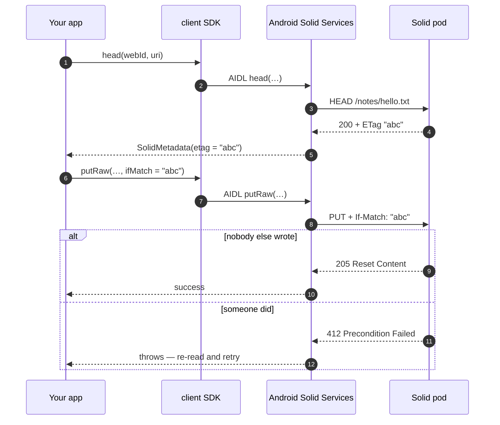

# Resources & containers

Everything on a pod is a resource, and this is how you work with them: files, RDF documents and
containers, with conditional writes, partial updates and streaming for the large ones.

Every other capability on this site — contacts, sharing, notifications — is written in terms of
these verbs. Learning them once covers the rest.

## What you can build

- Store and read your app's own data on the user's pod instead of your server.
- Sync safely across devices, without one overwriting the other.
- Upload and download files of any size without holding them in memory.
- Browse a pod like a filesystem — containers, listings, copy and move.
- Check what the user is allowed to do before you offer them the button.

## Setup

=== "Client (via Android Solid Services)"

    --8<-- "dependency-client.md"

    ```kotlin
    import com.erfangholami.androidsolidservices.client.sdk.Solid

    val resources = Solid.getResourceClient(context)
    ```

    Wait for the service before your first call:

    ```kotlin
    resources.resourceServiceConnectionState().first { connected -> connected }
    ```

    Calls throw a `SolidException` subtype on failure.

=== "API (direct to the pod)"

    --8<-- "dependency-api.md"

    ```kotlin
    import com.erfangholami.androidsolidservices.api.resource.SolidResourceManager

    val resources = SolidResourceManager.getInstance(authenticator)
    ```

    Calls return `SolidResult<T>`. Use `getOrThrow()`, or `getOrNull()` where absence is fine.

Every call takes the `webId` first. A device can hold several signed-in identities at once, and
the WebID picks which session signs the request.

## Recipes

### Write a file

```{ .kotlin .annotate }
resources.ensureContainer(webId, "${storage}notes/")          // (1)!
resources.putRaw(
    webId = webId,
    uri = "${storage}notes/hello.txt",
    contentType = "text/plain",
    body = "Hello from Android".toByteArray(),
)
```

1. Creates the container and every missing parent, bottom-up. Idempotent — call it every time
   rather than checking first. Some pod servers will not auto-create parents, so skipping this is
   the most common cause of a mysterious `404` on write.

### Read it back

```kotlin
val text = resources.readStream(webId, uri).use { it.stream().readBytes().decodeToString() }
```

`readStream` hands back a live pipe — always consume it inside `use { }`.

### Update without clobbering someone else

Two devices editing the same resource will overwrite each other unless you make the write
conditional. Read the ETag, then pass it back as `ifMatch`:

```{ .kotlin .annotate }
val meta = resources.head(webId, uri)                 // (1)!

resources.putRaw(
    webId = webId,
    uri = uri,
    contentType = "text/plain",
    body = newBody,
    ifMatch = meta.etag,                              // (2)!
)
```

1. `head` fetches only headers — ETag, content type and length, `WAC-Allow`, `Last-Modified` — with
   no body transfer. Cheap enough to call before every conditional write.
2. If anyone changed the resource since you read it, this fails with **412** instead of silently
   discarding their edit. Catch it, re-read, and either merge or ask the user.

Pass `ifMatch = "*"` instead to mean "must already exist", which turns a create into an
update-only.

### Change part of an RDF document

For RDF, prefer a patch over a full rewrite: it is atomic and does not need a read first, so two
concurrent patches to different triples both survive.

```kotlin
import com.erfangholami.androidsolidservices.shared.rdf.patch.N3Patch

resources.patch(
    webId = webId,
    uri = "${storage}profile/settings.ttl",
    patch = N3Patch.build {
        delete(subject, predicate, oldValue)
        insert(subject, predicate, newValue)
    },
)
```

The builder takes subject, predicate and an **IRI** object. For literal values use
`insertLiteral` / `deleteLiteral`, and `where(subject, predicate, variable)` to bind a variable the
patch matches on:

```kotlin
val patch = N3Patch.build {
    deleteLiteral(profileUri, VCARD.FN, "Old name")
    insertLiteral(profileUri, VCARD.FN, "New name")
}
```

`N3Patch.fromDiff(original, updated)` builds one from two versions of a resource, and
`N3Patch.insert(triples)` / `N3Patch.delete(triples)` take raw triple strings when you already have
them.

!!! tip "On Inrupt ESS"
    Some servers reject `text/n3` and accept only SPARQL Update. The library notices the 415 and
    retries as SPARQL automatically — you do not have to branch on the server.

### List a container

```kotlin
val children = resources.listContainer(webId, "${storage}notes/")

children.forEach { child ->
    println("${child.identifier} — ${child.headMetadata?.contentType ?: "container"}")
}
```

One request. Some servers describe their children in the listing already; where yours does not and
you need sizes or content types, pass `enrichWithHead = true` — that costs one extra request per
child, so do it only when you will show the data.

### Write into a container you were only given "Add" access to

`create` and `putRaw` PUT to a URI you choose, which needs **Write**. If you were granted *Add*
only — a drop-box — let the server pick the name instead:

```kotlin
val location = resources.createInContainer(webId, containerUri, resource)
```

This POSTs, needs only Append, and returns the URI the server allocated.

### Copy, move, rename

```kotlin
resources.copy(webId, sourceUri, destinationUri)     // works on a whole container tree
resources.move(webId, sourceUri, destinationUri)     // copy, then delete the source
resources.rename(webId, sourceUri, "new-name.txt")   // move to a sibling name
```

None of these are transactional — a failure part-way leaves both sides partially written. For a
tree that matters, verify afterwards.

### Stream a large file

Neither direction buffers the body in memory, so file size is bounded by the pod, not by your heap:

```{ .kotlin .annotate }
// Upload
contentResolver.openInputStream(pickedUri)?.let { input ->
    resources.writeStream(
        webId = webId,
        uri = "${storage}media/video.mp4",
        contentType = "video/mp4",
        source = input,                    // (1)!
        contentLength = knownLength,
    )
}

// Download
resources.readStream(webId, uri).use { stream ->
    stream.stream().copyTo(outputFile.outputStream())
}
```

1. Read once and closed for you. Do not reuse it afterwards.

This is also the way around the ~1 MB Binder transaction limit on the `client` path: streams cross
as a file descriptor, not as bytes in a transaction.

### Check access before offering the action

```kotlin
when (val probe = resources.probeAccess(webId, uri)) {
    is AccessProbe.Accessible ->
        if (ShareMode.WRITE in probe.modes) showEditButton() else showReadOnlyBadge()
    AccessProbe.Denied -> hideResource()
}
```

`Accessible` carries the exact `modes` the user holds, and the owner's WebID where the server
reports it — so you can distinguish "can read" from "can edit" rather than guessing.

!!! danger "Never treat an error as a denial"
    A network blip, a 5xx or an expired token **throws** — it does not come back as `Denied`.
    Collapsing a failure into "no access" is how apps end up hiding a button the user actually
    has the right to press.

### Delete

```kotlin
resources.delete(webId, resource)                     // one resource
resources.deleteContainer(webId, "${storage}notes/")  // container and everything under it
```

`deleteContainer` recurses inside Android Solid Services, so a deep tree costs one IPC round trip
rather than one per resource.

### Does it exist?

```kotlin
if (resources.exists(webId, uri)) { /* … */ }
```

A `404` is `false`. Anything indeterminate — 403, auth failure, network, 5xx — throws rather than
being flattened into `false`.

## How it flows

A conditional write on the `client` path:



## Errors you'll hit

| What you see | Why | What to do |
|---|---|---|
| `412 Precondition Failed` | someone wrote since your `head` | re-read, merge or ask the user, write again |
| `404` on a write | the parent container does not exist | call `ensureContainer` first |
| `403` on a write to a shared container | you have Add, not Write | use `createInContainer` and let the server name it |
| `415` on a patch | the server takes only SPARQL Update | already handled — the library retries automatically |
| `SolidNotLoggedInException` | no usable session for that WebID, including one that expired | send the user back through sign-in |
| `NotPermissionException` | your app has no grant for this account | the user declined; ask again |
| `TransactionTooLargeException` | body over ~1 MB on the `client` path | use `writeStream` / `readStream` |
| A read returning stale data | the in-memory response cache | it revalidates with ETags; a write invalidates it |
| `UnsupportedRdfContentTypeException` | the server answered Turtle | see the note on `Accept` under the hood |

## Under the hood

Everything below is how the manager behaves against a real pod. You do not need it to use the
API, but it explains most surprises.

<details class="info" markdown id="the-manager-and-the-pod-shape-it-reads-and-writes">
<summary>The manager, and the pod shape it reads and writes</summary>

`SolidResourceManager` is the library's whole conversation with a pod. Every read, write, patch,
delete, container listing, copy and byte stream goes through it, and everything above it — sharing,
notifications, the type index, the data modules — is written in terms of its verbs rather than its
own HTTP requests. It takes a `webId` on every call because a device can hold several authorized
identities at once: the WebID chooses which session signs the request, not which pod is addressed.

It is an interface with thirteen abstract verbs and nine that ship with a working default, so a test
double implements thirteen methods and inherits the rest, and the production manager overrides two of
the defaults with streaming versions. Locations are plain `String` IRIs; the library encodes them at
its own boundary via `encodeUriString` (idempotent), so callers store decoded identifiers and never
construct a `java.net.URI` at a call site
(`api/src/main/java/com/erfangholami/androidsolidservices/api/resource/SolidResourceManager.kt:28`).

#### Pod shape

LDP gives a pod two kinds of thing, and the resource model mirrors them exactly rather than
inventing a third:

| Type | What it is |
|---|---|
| `RDFResource` | An RDF source: triples held in memory as `RdfQuad`s, serialized to JSON-LD by `getEntity()`. |
| `NonRDFResource` | A non-RDF source: an opaque byte stream described only by its `Content-Type`. |
| `SolidRDFResource` / `SolidNonRDFResource` | The same, plus the server's `SolidMetadata` parsed from the response headers. |
| `SolidContainer` | An `ldp:BasicContainer`, i.e. a `SolidRDFResource` that also parses its own membership. |
| `WebId`, `PrivateTypeIndex`, index documents, … | Domain subclasses of `RDFResource`; the manager reads any of them by class token. |

A container is identified by a trailing `/`, and that convention is load-bearing: `delete` treats a
URI ending in `/` as a tree to remove recursively
(`SolidResourceManagerImplementation.kt:182`), `ensureContainer` walks up by trimming path segments,
and `SolidSourceReference.isContainerByUri()` uses it as the fallback when a listing carries no
`rdf:type`.

#### The container representation

`SolidContainer` builds its child references from the container's own RDF, reading `ldp:contains`
and whatever stat metadata the server chose to include alongside it — `rdf:type`, `stat:size`,
`dcterms:modified`, `stat:mtime`
(`Shared/src/main/java/com/erfangholami/androidsolidservices/shared/model/resource/SolidContainer.kt:53`).
That is the entire listing contract: one GET of the container yields the members and, on servers
that enrich, their sizes and modification times, which is why the type is a *reference* rather than
a resource. Anything the server did not volunteer stays `null` until someone HEADs the child.

#### The headers that matter

Solid puts most of its protocol in HTTP headers, and `SolidMetadata.from(headers)` is the single
place they are read
(`Shared/.../shared/model/resource/SolidMetadata.kt:177`). The four that drive behaviour rather than
display:

| Header | Read for | Written by |
|---|---|---|
| `Link: rel="type"` | Is this a storage root (`pim:Storage`)? Is this child a container? | Every `PUT` and `POST` the library makes, declaring the LDP interaction model. |
| `WAC-Allow` | What the caller may do, without writing anything — the basis of `probeAccess`. | — |
| `ETag` | The validator for a conditional write; strong vs weak decides *which* precondition is sent. | `If-Match` on `update`, `putRaw`, `patch`, `delete`. |
| `Accept-Patch` / `Accept-Post` / `Accept-Put` | Surfaced on `SolidMetadata`; PATCH format is settled by negotiation instead (see below). | — |

The request side is not guesswork — the library states the interaction model on every write, exactly
as here (`api/.../transport/SolidHttpClient.kt:160`):

```kotlin
val linkType = when {
    SolidContainer::class.java.isAssignableFrom(resource.javaClass) -> "<${LDP.BASIC_CONTAINER}>; rel=\"type\""
    RDFResource::class.java.isAssignableFrom(resource.javaClass) -> "<${LDP.RDF_SOURCE}>; rel=\"type\""
    else -> "<${LDP.NON_RDF_SOURCE}>; rel=\"type\""
}
```

On the response side, a HEAD of a container carries the shapes the code parses — the `WAC-Allow`
form is the one documented at `Shared/.../shared/http/HTTPConstants.kt:40` and parsed at
`WacAllow.kt:55`, and the `Allow` form the one at `Shared/.../shared/util/HeaderExtensions.kt:152`:

```http
Link: <http://www.w3.org/ns/ldp#BasicContainer>; rel="type"
Link: <http://www.w3.org/ns/pim/space#Storage>; rel="type"
WAC-Allow: user="read write", public="read"
Allow: GET, HEAD, OPTIONS, PUT, PATCH, DELETE
ETag: W/"1234-abc"
```

That `W/` prefix is not cosmetic. `getETag()` returns only *strong* tags
(`HeaderExtensions.kt:122`), because `If-Match` uses the strong comparison function and a weak
validator can never satisfy it — sending one guarantees a 412. `EntityTag.parse` keeps the strength
so callers can tell the two apart (`Shared/.../shared/http/EntityTag.kt`).

#### Accept, and the RDF formats that are deliberately absent

A read sends `Accept: application/ld+json` when the requested class is an `RDFResource`, and `*/*`
otherwise (`SolidHttpClient.kt:137`). The parser accepts JSON-LD and N-Triples/N-Quads, and
**throws** `UnsupportedRdfContentTypeException` for Turtle, N3, TriG, RDF/XML and RDF/JSON
(`SolidResourceParser.kt:92`). JSON-LD contexts resolve offline where they can: the Activity
Streams 2.0 context ships inside `Shared`, and any other remote context is fetched once and kept in
an in-memory cache
(`Shared/src/main/java/com/erfangholami/androidsolidservices/shared/rdf/jsonld/JsonLdContexts.kt`).

This is a decision, not a gap. Shipping a Turtle reader means shipping an RDF parser stack into an
Android APK; the library instead relies on content negotiation, which every Solid server supports,
and fails loudly with the content type and URI in the message when a server ignores the `Accept`
header. The failure names exactly what happened rather than returning an empty triple set that would
look like an empty document.

</details>

<details class="info" markdown id="the-public-surface-in-full">
<summary>The public surface in full</summary>

The thirteen verbs an implementation must provide:

| Verb | Signature that matters |
|---|---|
| `head` | `head(webId, uri): SolidResult<SolidMetadata>` — headers only, no body. |
| `read` | `read(webId, resource, clazz): SolidResult<T>` — the class token picks the codec. |
| `create` | `create(webId, resource): SolidResult<T>` — PUT with `If-None-Match: *`. |
| `update` | `update(webId, newResource, ifMatch, ifUnmodifiedSince): SolidResult<T>` — the conditional PUT. |
| `patch` / `patchRaw` | `patch(webId, uri, patch: N3Patch, ifMatch)` and the pre-serialized `text/n3` twin for IPC. |
| `delete` | `delete(webId, resource)` and `delete(webId, resourceUri, ifMatch): SolidResult<Boolean>`. |
| `putRaw` / `post` | Opaque bodies, for endpoints that reject the compacted JSON-LD `update` produces and for LDN inbox writes. |
| `createInContainer` | `createInContainer(webId, containerUri, resource): SolidResult<String?>` — POST, server allocates the URI. |
| `readPublic` / `headPublic` | Unauthenticated reads, for world-readable documents like foreign WebID profiles. |

The nine that come with a default, so a fake gets them free
(`SolidResourceManager.kt:90`–`:303`): `exists`, `ensureContainer`, `probeAccess`, `listContainer`,
`copy`, `move`, `rename`, `readStream`, `writeStream`. The production manager overrides only the
last two, replacing the buffering fallbacks with real streaming
(`SolidResourceManagerImplementation.kt:227`).

Three of the defaults exist to stop callers from re-deriving a subtle rule:

- `exists` collapses only a 404 to `false`; a 403, an auth blip or a 5xx stays a `Failure`, because
  "couldn't tell" is not "absent" (`SolidResourceManager.kt:90`).
- `probeAccess` returns `Accessible`/`Denied` for authoritative answers and a `Failure` for
  indeterminate ones. A reachable resource that advertises no `WAC-Allow` is reported as View
  (`SolidResourceManager.kt:136`).
- `ensureContainer` recurses to the parent before creating, so it works on servers that do not
  auto-create intermediates, and stops at the first ancestor that exists.

#### The reified read

`read` takes a `Class<T>` because the parser needs a constructor to reflect on, but callers should
not have to write Java class literals. `ReifiedReads.kt` forwards verbatim:

```kotlin
public suspend inline fun <reified T : Resource> SolidResourceManager.read(
    webId: String,
    uri: String,
): SolidResult<T> = read(webId, uri, T::class.java)
```

Same for `readPublic`. No behaviour is added — this is the whole file, and that is the point
(`api/.../resource/ReifiedReads.kt:13`).

#### Reflective codec construction

`SolidResourceParser.parse` decides what to build from the *requested* class, not the response
(`SolidResourceParser.kt:24`). A `SolidContainer` subclass and any other `RDFResource` subclass are
constructed through `getConstructor(String, String, List, SolidHeaders)` and handed the URI, content
type, parsed quads and headers; a non-RDF class is tried against three constructor shapes in turn —
`(String, String, InputStream, SolidHeaders)`, then `(String, String, SolidHeaders, InputStream)`,
then `(String, String, InputStream)` — before giving up (`SolidResourceParser.kt:113`).

That is why a domain type like `WebId` or a data module's index document needs no registration
anywhere: it is an `RDFResource` subclass with the four-argument constructor, so `read<WebId>(…)`
already works. The cost is that the constructor signature is a real contract — the reflective lookup
is also why the library's consumer ProGuard rules keep resource constructors. Containers are parsed
with `i18nDirection = false` and other RDF sources with `true`, so a directional language string in a
document round-trips as an `i18n-datatype` while a container listing stays plain
(`SolidResourceParser.kt:49`, `:66`).

#### The rest of the surface

- `StreamingResource` — an unbuffered body with a `close()` that releases the network response;
  callers use `use { }` (`api/.../resource/StreamingResource.kt:24`).
- `ProfileOperations.kt` — `readProfile`, `updateProfile`, `setAvatar` as extension functions over
  the core verbs. `readProfile` merges the WebID document with every extended profile document it
  links, and reads all of them *unauthenticated*, because a foreign issuer's token is often rejected
  against another pod's profile (`api/.../resource/ProfileOperations.kt:23`).
- `SolidResourceManager.getInstance(authenticator)` returns an application-scoped singleton; the
  first call binds the authenticator and later calls return that same instance
  (`SolidResourceManagerImplementation.kt:41`).
- `setHttpTrace(true)` turns on `→ METHOD URI` / `← STATUS METHOD URI` logging under the tag
  `SolidHttp`, with a body excerpt for non-2xx only.

</details>

<details class="info" markdown id="how-it-flows-in-detail">
<summary>How it flows in detail</summary>

#### A conditional write: `casUpdate`

Anything that edits a shared document — a type index, a data-module index, a contact book — goes
through `casUpdate`, and nothing else in the library open-codes read-modify-write
(`api/.../resource/implementation/ConditionalUpdate.kt:16`). The loop is four steps:

1. **Read** through the caller's own lambda, so the caller keeps its codec and its URI.
2. **Mutate** the in-memory resource. The lambda returns a `Boolean`: `false` means "nothing
   changed", and the write is skipped entirely — an idempotent caller costs zero requests.
3. **Precondition.** The ETag from the *just-read* resource becomes `If-Match`. When the server gave
   only a weak tag, `getETag()` returns `null` and the `Last-Modified` value is sent as
   `If-Unmodified-Since` instead (`ConditionalUpdate.kt:31`). Never both: a strong validator always
   wins.
4. **Retry on 412.** A `PRECONDITION_FAILED` re-enters the loop — re-reading, so the concurrent
   writer's change is in hand before the mutation is applied again — with a jittered backoff and a
   budget of four attempts. Any other failure returns immediately, because retrying a 403 is just a
   slower 403.

The important property is that the retry re-reads. Two devices adding rows to the same index both
land: the loser of the race sees the winner's row before re-applying its own, which
`CasUpdateTest.kt:169` pins by asserting both predicates survive.

#### Creating inside a container: PUT versus POST

`create` PUTs to a URI the caller chose, with `If-None-Match: *` so an existing resource is not
silently overwritten (`SolidResourceManager.kt:327`). `createInContainer` POSTs the same resource to
the container and lets the **server** mint the URI, using the resource's identifier only to derive a
`Slug` hint (`SolidHttpClient.kt:398`, `slugFrom` at `:434`).

The difference is not stylistic, it is the difference between working and not working on a shared
container. WAC's `acl:Append` permits adding new members but not modifying existing ones; a PUT to a
chosen URI is a write to *that* URI and demands `acl:Write`, so an Append-only recipient is refused
even for a name nobody is using. A POST to the container is an append to the container, which is
exactly the right the grant conveys. So the rule is: own the container, `create`; contributing to
someone else's shared container, `createInContainer` and store whatever `Location` comes back — that
URI, not the one you would have picked, is the resource's identity.

`post` is the untyped sibling, used for LDN inbox writes where the body is an AS2 activity and the
target is an inbox container; it returns the `Location` too (`SolidResourceManager.kt:532`).

#### Storage discovery

Several features need "where does this identity keep its data" before they can allocate anything.
`StorageDiscovery.discover` answers in two passes and never guesses a path
(`api/.../resource/implementation/StorageDiscovery.kt:10`):

1. Read the profile and take the first `pim:storage`. If the WebID document has none, follow
   `foaf:isPrimaryTopicOf` / `rdfs:seeAlso` into the extended profile documents and look there.
2. Failing that, walk up from the WebID document's own container, HEADing each ancestor and stopping
   at the first that advertises `Link: rel="type" <pim:Storage>`, bounded to 32 hops.

Returning `null` is a real answer, and callers treat it as one — `requireStorage` in the data-module
toolkit throws with the WebID in the message rather than allocating somewhere plausible.

#### Reads go through a short-lived cache

GET and HEAD pass through `SolidResponseCache` keyed by principal, method, URL and `Accept`
(`api/.../transport/SolidResponseCache.kt:58`). Fresh entries are served directly;
stale ones are revalidated with `If-None-Match` (or `If-Modified-Since`), and a `304` refreshes the
stored entry rather than re-downloading it. Concurrent callers for the same key single-flight onto
one request. TTL is 5 seconds for data and 60 for things that rarely move — WebID profiles and
`.acl`/`.acr` documents (`SolidHttpClient.kt:495`). Responses carrying `no-store` or `Vary: *` are
never stored, and 404/410 evicts.

Every write invalidates the target **and its parent container**, because a create or delete changes
the parent's `ldp:contains` listing as much as it changes the resource
(`SolidResponseCache.kt:90`). A 412 invalidates too — a failed precondition means the cached
validator is already wrong.

One behaviour to know about listings: the production `read` of a container HEADs each child
concurrently to fill `headMetadata` (`SolidResourceManagerImplementation.kt:71`), so
`listContainer(enrichWithHead = false)` is a single GET only over an implementation whose `read`
does not enrich — which is what the fake in `ContainerVerbsTest.kt:121` pins. The recursive delete
path deliberately bypasses that by calling the HTTP client's `get` directly rather than `read`.

</details>

<details class="info" markdown id="failure-behaviour">
<summary>Failure behaviour</summary>

Every verb returns `SolidResult<T>`: `Success(value)` or `Failure(SolidError)`, and never a thrown
domain exception, a nullable "maybe it worked", or an empty success
(`Shared/.../shared/result/SolidResult.kt:16`). `SolidError` carries a stable `SolidErrorCode` to
branch on, a developer-facing message that is explicitly *not* an end-user string, the `httpStatus`
when a server answered, a `retryable` hint and the `cause`. Statuses are classified in exactly one
place, `SolidError.fromHttp` (`Shared/.../shared/result/SolidError.kt:302`), and throwables in
`fromThrowable` (`:324`); cancellation is rethrown rather than converted, at every catch site.

**404 means absent, and only that.** `exists` reports `false`, `probeAccess` reports `Denied`, the
recursive delete treats a missing child as already deleted (`SolidResourceManagerImplementation.kt:310`),
and the data-module layer's tolerant delete calls it success. No other status is folded into
absence.

**Weak-ETag servers.** Node Solid Server emits only weak validators for RDF, so an `If-Match` there
fails 100% of the time. Rather than sending a doomed precondition or dropping to an unconditional
write, `casUpdate` falls back to `If-Unmodified-Since` — one-second granularity optimistic
concurrency instead of none. `CasUpdateTest.kt:147` runs the whole loop against a pod that emits
`W/"…"` and asserts the fallback header is what went out.

**412 is surfaced, not translated** — except in `create`, where a 412 from `If-None-Match: *` means
the resource already exists, and is reported as `409 Conflict` because that is what actually
happened (`SolidResourceManagerImplementation.kt:104`).

**Redirects, and re-signing DPoP.** OkHttp's own redirect following is switched off
(`SolidHttpClient.kt:48`) and the client follows redirects itself, up to five hops. It has to: a
DPoP proof is bound to the method and URL it was minted for, so a proof carried over to the new
`Location` would be rejected. Each hop rebuilds the auth headers for the URI it is about to request
(`SolidHttpClient.kt:739`), and credentials are attached only while the hop stays on the origin the
request started at (`:695`) — a cross-origin redirect is followed anonymously rather than leaking a
token to whatever host the `Location` named. A 303 on a non-GET/HEAD request becomes a GET with the
body dropped, per HTTP. `SolidHttpClientTest.kt:156` and `:178` pin both halves.

**The 401 classifier.** A 401 answers two unrelated questions with one status, and the library
refuses to conflate them (`api/.../transport/AuthChallenge.kt`):

| `WWW-Authenticate` says | Classified as | Response |
|---|---|---|
| `use_dpop_nonce` (and no token complaint) | `NonceStale` | Retry with the server's nonce. No refresh. |
| `invalid_token` / `expired_token` | `TokenExpired` | Force one token refresh, then retry. |
| `insufficient_scope` / `invalid_request` | `NotAuthorized` | Return the 401. Refreshing cannot change the answer. |
| Nothing machine-readable | `Unspecified` | Refresh **only** if the request was against the identity's own origin. |

That last row is the one that matters. A bare 401 from a foreign pod is an authorization outcome, not
an expiry: a server that meant "your token is stale" would have said so. Treating it as expiry turns
every cross-pod read of a resource you cannot see into refresh traffic — which rate-limits a healthy
token, and on providers that revoke a refresh-token family when a token is replayed, kills the
session outright. So `warrantsTokenRefresh(requestIsOwnOrigin)` returns `false` there, and the
manager logs "401 kept as authorization outcome" instead of spending a refresh
(`SolidHttpClient.kt:770`). A refresh is attempted at most once per request, and the whole retry
budget is three attempts.

**PATCH format negotiation, in both directions.** The Solid Protocol makes `text/n3` the mandatory
PATCH format; Inrupt ESS deployments advertise only SPARQL Update and answer 415 for N3. So `patch`
sends `application/sparql-update` first and retries as `text/n3` on a 415
(`SolidHttpClient.kt:205`), while `patchRaw` — whose body arrived as N3 text across the AIDL
boundary — sends N3 first and retries as SPARQL, translating via `N3PatchConverter`
(`:242`). When the converter cannot read a document with confidence it returns `null` and the
server's original 415 is kept, rather than a guessed rewrite being sent
(`api/.../resource/implementation/N3PatchConverter.kt:29`). A 403 is never reinterpreted as a media
type problem.

**Recursive delete.** Children are deleted with bounded concurrency (6) and each transient
failure — 408, 429, 5xx, or no response at all — is retried up to four times with exponential
backoff (`SolidResourceManagerImplementation.kt:299`). If any child still fails, the container is
**left intact** and a 409 naming the count is returned, because a half-emptied container the caller
believes is gone is worse than a container that is still there.

</details>

<details class="info" markdown id="extension-points">
<summary>Extension points</summary>

- **`SolidResourceManager` is an interface, and most of it is defaults.** A fake implements thirteen
  methods; `casUpdate`, `probeAccess`, `copy`, `ensureContainer` and the rest then run their real
  logic over it. Every resource test in the library is written this way, which is why they exercise
  the shipped code paths rather than a re-implementation.
- **`SolidHttpClient(auth, httpClient)`** takes an `OkHttpClient`, so a test can point the real
  client at a `MockWebServer`, and an `AuthSession`, so the DPoP/refresh behaviour can be observed
  without an identity provider (`SolidHttpClient.kt:41`).
- **`SolidHttpClient.cacheEnabled`** and **`setHttpTrace`** are the two runtime switches: the first
  lets a test see every request, the second is for diagnosing a bare 401/403/404 in the field.
- **Resource subclasses are the codec seam.** Any `RDFResource` subclass with the four-argument
  constructor can be read by class token; no registry, no factory.
- **`ProfileOperations` and `ReifiedReads` are extension functions**, not interface members, which is
  the intended shape for new conveniences: they compose the verbs, so they cannot drift from them
  and cost nothing to a fake.
- **The IPC surface mirrors this API** — `client/.../sdk/SolidResourceClient.kt` exposes the same
  verbs across AIDL, including `probeAccess`, which is why `AccessProbe` is `Parcelable` and lives in
  `Shared` rather than `api`.

</details>

<details class="info" markdown id="tests">
<summary>Tests</summary>

They live in `api/src/test/java/com/erfangholami/androidsolidservices/api/resource/`, split between
behaviour pinned over a fake manager and wire behaviour pinned over `MockWebServer`.

| File | What it pins |
|---|---|
| `CasUpdateTest.kt` | The whole conditional-write contract: strong ETag on the first attempt; the weak-ETag fallback to `If-Unmodified-Since`; re-read-and-retry on 412 preserving the concurrent writer's change; no write at all when `mutate` returns `false`; and a `PRECONDITION_FAILED` once the budget is spent. |
| `ContainerVerbsTest.kt` | Listing over an unenriched `read` costs zero HEADs; `copy` duplicates bytes verbatim and leaves the source; a container tree is recreated in full; `move` copies then deletes; `rename` lands on a sibling URI. |
| `ProbeAccessTest.kt` | `WAC-Allow` modes and owner; no header means View; 403/404 are `Denied`; a 5xx is a `Failure`, **not** `Denied`; an empty mode list is `Denied`. |
| `SolidResourceManagerCapabilitiesTest.kt` | `exists` on present and absent; `ensureContainer` creating the missing ancestor chain and doing nothing when the target is there. |
| `StreamingFallbackTest.kt` | The interface defaults: `writeStream` buffers and delegates to `putRaw` with progress; `readStream` wraps a buffered read. |
| `ProfileOperationsTest.kt` | The extended-profile merge, the safe-replace patch, the no-op when nothing is passed, the avatar upload, and that the reified read forwards to the token overload. |
| `implementation/SolidHttpClientTest.kt` | The wire: a nonce 401 retried without a refresh; an `expired_token` 401 refreshed exactly once; a persistent 401 returned rather than looped; a quoted `If-Match`; same-origin redirects re-signed and cross-origin redirects stripped of credentials; both PATCH fallbacks; streaming GET/PUT including re-opening the source on retry; the `Location` from a POST. |
| `implementation/AuthChallengeTest.kt` | The classifier one row at a time. The foreign-origin case is named `a bare 401 from a foreign pod is a denial, not an expiry`, and its assertion message records why the rule exists: "this is the cross-pod read that produced the refresh storm". |
| `implementation/N3PatchConverterTest.kt` | Round-tripping the N3 documents the SDK itself emits into SPARQL, and refusing — rather than guessing at — ambiguous or unterminated ones. |
| `implementation/SolidResponseCacheTest.kt`, `…CancellationTest.kt` | Freshness, 304 revalidation, LRU eviction, per-principal isolation, separate HEAD and GET entries, `no-store`/oversize/error responses staying uncached, concurrent identical reads coalescing into one fetch, and a cancelled single-flight follower throwing instead of busy-spinning. |

Two fixtures carry the rest: `api/src/test/java/.../api/testing/InMemoryPodResourceManager.kt` (a
map-backed pod that records `rawPuts`, `patches` and `deletedUris`, and can be told to fail specific
deletes) and `api/src/test/java/.../api/notifications/FakeSolidResourceManager.kt` (lambda-per-verb,
for tests that only care about one call).

</details>

<details class="info" markdown id="specifications-implemented">
<summary>Specifications implemented</summary>

- [Solid Protocol](https://solidproject.org/TR/protocol) — resource identity, auxiliary resources
  via `Link: rel="acl"`, storage discovery through `pim:Storage`, and the `solid:owner` link.
- [Linked Data Platform](https://www.w3.org/TR/ldp/) — the RDF-source/non-RDF-source split the model
  mirrors, `ldp:contains`, and the interaction model declared by `Link: rel="type"` on create.
- [RFC 9110 §13, Conditional Requests](https://www.rfc-editor.org/rfc/rfc9110#section-13) —
  `If-Match`, `If-None-Match`, `If-Unmodified-Since`, and the strong comparison function that makes
  a weak ETag useless for `If-Match`. This is the whole basis of `casUpdate`'s fallback.
- [Solid Protocol §N3 Patch](https://solidproject.org/TR/protocol#n3-patch) — the mandatory PATCH
  format, which `N3Patch` builds and serializes. SPARQL Update is **not** a Solid requirement; the
  library sends it because deployments demand it, and negotiates back to N3 on a 415.
- [Web Access Control](https://solidproject.org/TR/wac) — the `WAC-Allow` header `probeAccess`
  reads, and the `acl:Append`-versus-`acl:Write` distinction that makes `createInContainer` a
  separate verb.
- [RDF 1.1 Turtle](https://www.w3.org/TR/turtle/) — **not implemented as a read format**, and named
  here so a reader can tell an omission from a decision: reads negotiate for JSON-LD or N-Triples
  and a Turtle response raises `UnsupportedRdfContentTypeException`. Revisited if a server appears
  that ignores `Accept`.

</details>
