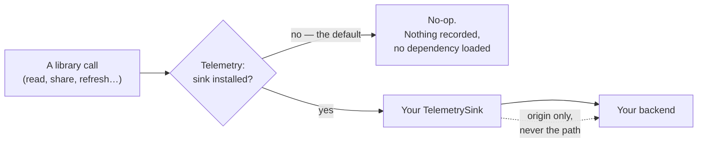

# Telemetry

The libraries are instrumented, but they carry **no monitoring dependency**. `Shared` defines an
interface; nothing implements it until a host app installs a sink. Install nothing and every call
is a no-op.

That is deliberate: adding this SDK to your app must not add Firebase, or any other backend, to
it. What you monitor stays your decision.

## What you can build

- Crash reports and traces from the SDK, landing in the backend you already use.
- Latency measurement of real pod calls, per origin, without patching the library.
- Nothing at all — which is the default, and needs no action.

## Setup

Only if you want reporting. Implement `TelemetrySink` and install it once, at startup:

```kotlin title="YourApplication.kt"
import com.erfangholami.androidsolidservices.shared.telemetry.Telemetry

class YourApplication : Application() {
    override fun onCreate() {
        super.onCreate()
        if (BuildConfig.TELEMETRY_ENABLED) {
            Telemetry.install(YourSink())     // (1)!
        }
    }
}
```

1. Gate it on a build flag. Android Solid Services itself installs its sink in release builds only
   and leaves the no-op in place for debug, so development never ships noise to a dashboard.

`Telemetry.uninstall()` puts the no-op back — useful when a user withdraws consent at runtime.

## Recipes

### Report to your own backend

`TelemetrySink` has five members. Implement all of them — spans, network spans, exceptions,
breadcrumbs and keys:

```kotlin
class YourSink : TelemetrySink {

    override fun startSpan(name: String): TelemetrySpan = object : TelemetrySpan {
        private val trace = YourTracer.start(name)
        override fun putAttribute(key: String, value: String) = trace.attr(key, value)
        override fun putMetric(key: String, value: Long) = trace.metric(key, value)
        override fun stop() = trace.stop()
    }

    override fun startNetworkSpan(url: String, method: String): TelemetryNetworkSpan =
        object : TelemetryNetworkSpan {
            private val trace = YourTracer.startHttp(url, method)   // (1)!
            override fun setResponseCode(code: Int) = trace.status(code)
            override fun setRequestPayloadSize(bytes: Long) = trace.requestSize(bytes)
            override fun setResponsePayloadSize(bytes: Long) = trace.responseSize(bytes)
            override fun setResponseContentType(contentType: String?) = trace.contentType(contentType)
            override fun putAttribute(key: String, value: String) = trace.attr(key, value)
            override fun stop() = trace.stop()
        }

    override fun recordException(throwable: Throwable, attributes: Map<String, String>) {
        YourCrashReporter.report(throwable, attributes)
    }

    override fun log(message: String) = YourCrashReporter.breadcrumb(message)

    override fun setKey(key: String, value: String) = YourCrashReporter.setTag(key, value)
}
```

1. `url` here is the request **origin** — `https://alice.solidcommunity.net` — never the path. See
   below.

### Make collection user-consented

```kotlin
fun onConsentChanged(granted: Boolean) {
    if (granted) Telemetry.install(YourSink()) else Telemetry.uninstall()
}
```

Because the seam is a single install point, consent is a one-line switch rather than a flag
threaded through every call site.

## What you get, and what you never get

Network spans report the **origin only** — `https://alice.solidcommunity.net`, never the path.

!!! danger "Pod paths identify the user"
    A path like `/contacts/b1/Person/p3/index.ttl` says this person keeps contacts and how many.
    The instrumentation is built so a path cannot reach your dashboard even if you want it to.
    Do not add one in your own sink.

Also never reported: WebIDs, tokens, DPoP proofs, resource bodies, RDF contents, and the names of
anything on a pod.

## How it flows



The decision is made per call against a single installed reference, so installing or uninstalling
takes effect immediately — no restart, and no flag to thread through call sites.

## Errors you'll hit

| What you see | Why | What to do |
|---|---|---|
| No data in your dashboard | no sink installed, or installed after the calls | install in `Application.onCreate` |
| Debug builds reporting | the build flag was not gated | gate `install` on a release-only flag |
| Nothing from a standalone `api` consumer | a host app's crash reporter cannot report for another app | expected; install your own sink |
| Paths in your dashboard | your sink added them | the library never emits them — remove it from your sink |

## Under the hood

A session that dies on a stranger's phone cannot be debugged from a stack trace you never
received. The library therefore has to be observable in production — but an SDK that ships an
analytics dependency makes that dependency, and its privacy posture, every consumer's problem.
`Telemetry` is the seam that squares this: one object in `Shared`
(`Shared/src/main/java/com/erfangholami/androidsolidservices/shared/telemetry/Telemetry.kt:125`)
through which every signal the library emits passes, and behind which there is nothing until the
host application installs a `TelemetrySink`. No sink, no dependency, no bytes leaving the
process. The library never knows which backend it is talking to — Firebase, Sentry,
OpenTelemetry and plain logs are all one interface away — and the FOSS build of the host app
proves the point by installing nothing at all.

<details class="info" markdown id="pod-shape">
<summary>Pod shape</summary>


None, and that is the point. Telemetry owns no containers, no documents and no RDF — nothing is
ever written to or read from any pod, and no signal references one beyond its hostname. Signals
exist only in process and leave it only through whatever sink the host installed.

</details>

<details class="info" markdown id="public-surface">
<summary>Public surface</summary>


#### `Telemetry` — the entry point

| Member | What it does |
|---|---|
| `install(sink)` / `uninstall()` | Sets the destination for all subsequent signals; uninstall restores the built-in no-op. The most recently installed sink wins. |
| `isInstalled` | Whether anything other than the no-op is installed. |
| `startSpan(name)` | A timed unit of work; returns a no-op span when no sink is installed, so callers never null-check. |
| `startNetworkSpan(url, method)` | A timed outbound HTTP request. `url` is the request *origin* only — callers strip the path, query and fragment before reporting, because pod URLs identify the user (`Telemetry.kt:82`). |
| `recordException(throwable, attributes)` | A handled, non-fatal error with contextual attributes; map and vararg overloads. |
| `log(message)` | A breadcrumb attached to subsequent reports. |
| `setKey(key, value)` | A key/value pair attached to subsequent reports. |

Every member is thread-safe and none ever throws: an exception raised by the installed sink is
swallowed rather than propagated into SDK code, and the span factories fall back to no-op span
objects when the sink fails (`Telemetry.kt:148`). A broken monitoring backend can lose signals;
it cannot break a login.

#### The span contracts

`TelemetrySpan` carries `putAttribute`, `putMetric` and an idempotent `stop`;
`TelemetryNetworkSpan` carries `setResponseCode`, `setRequestPayloadSize`,
`setResponsePayloadSize`, `setResponseContentType`, `putAttribute` and `stop`. The privacy rule
is stated on the contract itself: attributes are low-cardinality labels, and user-identifying
data — WebIDs, pod resource paths, tokens — must never be passed, because sinks forward
attributes to third-party backends (`Telemetry.kt:14`).

#### `traced` and the attribute vocabulary

`traced(name) { … }` (`Telemetry.kt:213`) runs a block inside a span, marks
`outcome=success/error`, reports a thrown exception with the span's name attached, and always
stops the span. `TelemetryAttribute` (`Telemetry.kt:232`) fixes the names the library reports —
`outcome`, `span`, `operation`, `calling_app`, `error_type`, `host`, `method` — so dashboards
built on one release survive the next.

Three parts of this surface have no library call site today, and that is deliberate. The two
auth spans manage their lifecycle by hand instead of through `traced` because their outcome
vocabulary is richer than success/error (`terminal`, `transient`). `putMetric` and the `host` /
`method` constants are part of the contract for sinks and future spans — the network span
carries its origin and method as constructor arguments instead — and they are exercised by the
tests so a sink must implement them.

</details>

<details class="info" markdown id="how-it-flows">
<summary>How it flows</summary>


#### Installing a sink

The host calls `Telemetry.install(sink)` from `Application.onCreate`. This repository's own
`:app` host is the reference in both directions:

- The `gms` flavor installs `FirebaseTelemetrySink`
  (`app/src/gms/java/com/erfangholami/androidsolidservices/telemetry/FirebaseTelemetrySink.kt:11`),
  which maps spans to Firebase Performance `Trace`s, network spans to `HttpMetric`s, and
  exceptions, breadcrumbs and keys to Crashlytics. Installation is gated on
  `BuildConfig.TELEMETRY_ENABLED` and skipped entirely when Firebase fails to initialise
  (`app/src/gms/java/com/erfangholami/androidsolidservices/telemetry/TelemetryInstaller.kt:13`).
- The `foss` flavor installs nothing, so the no-op sink stays and the libraries emit nothing
  (`app/src/foss/java/com/erfangholami/androidsolidservices/telemetry/TelemetryInstaller.kt:13`).
  That absence is a decision with a stated reason: F-Droid rejects proprietary analytics, and
  its Tracking anti-feature covers any reporting that is not opt-in and off by default, so a
  future FOSS sink has to be consent-gated.

#### What a consumer then sees

Once a sink is in, every pod request arrives as a network span: `SolidHttpClient.send` opens it
with origin and method before the call, sets the request body size, then the status code,
response size and content type, and stops it in a `finally` so transport failures are timed too
(`api/src/main/java/com/erfangholami/androidsolidservices/api/transport/SolidHttpClient.kt:81`).
Logins and token refreshes arrive as the `solid_auth_login` and `solid_auth_refresh` spans.
Handled failures arrive through `recordException` with `operation` attributes; breadcrumbs
arrive through `log` and attach to whatever report comes next. In the IPC host, every AIDL call
stamps `calling_app` with the caller's package name before doing anything else
(`app/src/main/java/com/erfangholami/androidsolidservices/services/dispatch/AidlDispatch.kt:40`),
so a report can be traced to the integrating app that triggered it.

</details>

<details class="info" markdown id="what-is-reported">
<summary>What is reported</summary>


The full span inventory:

| Span | Attributes and measurements | Site |
|---|---|---|
| network span (every pod request) | origin, method; request and response bytes; status code; response content type | `SolidHttpClient.kt:81` |
| `solid_auth_login` | `outcome`; on failure `stage` (`token_exchange`, `no_id_token`, `id_token_validation`, `issuer_mismatch`) and the OAuth `auth_error` code; on success the issuer host and `refresh_token` present/absent | `AuthenticatorImplementation.kt:160` |
| `solid_auth_refresh` | issuer host, `forced`; `outcome` `success` / `terminal` / `transient`; `rt_rotation` (`rotated`, `reissued_same`, `unrotated`) | `TokenRefreshCoordinator.kt:273` |

The `recordException` inventory:

| `operation` | Extra attributes | Raised when |
|---|---|---|
| `solid.http` | `error_type` (exception class name) | a non-I/O throwable escapes a request (`SolidHttpClient.kt:668`) — a request refused because the WebID has no usable session (`SolidError.NotAuthenticated`) is a breadcrumb instead (`:667`) |
| `solid.auth.refresh` | `auth_error`, issuer host | a refresh fails terminally — `invalid_grant` / `invalid_client` (`TokenRefreshCoordinator.kt:316`) |
| `solid.auth.expiry` | `auth_error`, `reason=no_refresh_token`, issuer host | the access token is spent and there is no refresh token (`TokenRefreshCoordinator.kt:372`) |
| `solid.auth.profile_store` | `auth_error` ∈ `store_init_failed`, `store_decrypt_failed` (+ `strikes`), `store_corrupt`, `store_wiped`, `store_key_unrecoverable` | the encrypted profile store misbehaves (`ProfileManager.kt:124`, `UserRepositoryImplementation.kt:69`, `:100`, `:160`, `KeystoreCipher.kt:70`) |
| `solid.auth.dpop_key` | `auth_error=dpop_key_unrecoverable` | a DPoP key exists in the Keystore but cannot be loaded (`DPoPGenerator.kt:202`) |
| `aidl.dispatch` / `aidl.dataModule` | `error_type`, `calling_app` | an uncaught throwable in the IPC service host (`AidlDispatch.kt:55`, `:98`) |

Breadcrumbs (`Telemetry.log`) narrate the decisions between those events: whether a 401 was kept
as an authorization outcome or converted into a forced token refresh, with the request origin
and the `WWW-Authenticate` value truncated to 60 characters (`SolidHttpClient.kt:770`, `:776`), and
a forced refresh that fails, after which the 401 is returned as it stands (`:782`);
transient refresh failures by OAuth error code (`TokenRefreshCoordinator.kt:340`); token-endpoint
429 backoff in seconds (`:429`) and forced-refresh suppression (`:415`); the authorization
response's error code when a login is abandoned (`AuthenticatorImplementation.kt:156`); JWKS
refetch falling back to cached keys, by issuer host and cache age (`IdTokenVerifier.kt:61`,
`:67`); DPoP signing retries after a Keystore operation prune (`DPoPGenerator.kt:111`); the
generation of the profile-store key and of a DPoP key — the latter naming its Keystore alias,
which is built from a random per-login identifier, not from the WebID
(`KeystoreCipher.kt:57`, `DPoPGenerator.kt:209`, `AuthenticatorImplementation.kt:121`); the
active-account reconciler moving, clearing or ignoring a stale emission, with profile *counts*
only (`ProfileManager.kt:159`, `:177`, `:186`); and I/O transport failures as exception class
plus message (`SolidHttpClient.kt:666`), and a request refused for lack of a signed-in session
(`:667`). The one `setKey` call site is the IPC host stamping
`calling_app` (`AidlDispatch.kt:40`).

</details>

<details class="info" markdown id="what-is-never-reported">
<summary>What is never reported</summary>


This is the load-bearing half, and each rule is visible at a call site:

- **Tokens, never, in any form.** Access, refresh and ID tokens, DPoP proofs and key material
  appear in no span, attribute, breadcrumb or exception attribute. Where the auth log needs to
  correlate token rotation it uses logcat with `tokenFp` fingerprints — compare the `Log.i` at
  `TokenRefreshCoordinator.kt:266`, which fingerprints the refresh token, with the span two
  lines later, which reports only the issuer host and a `forced` flag. `rt_rotation` reports
  *that* rotation happened, not anything about the token.
- **Full resource URLs, never.** Network spans carry `telemetryOrigin()` — lowercased scheme,
  host and explicit port, with path, query, fragment and userinfo all dropped, and hostless URIs
  degrading to `scheme://unknown` rather than leaking what follows the scheme
  (`api/src/main/java/com/erfangholami/androidsolidservices/api/transport/TelemetryOrigin.kt:5`).
  The 401 breadcrumbs likewise report `scheme://authority` only. A pod path like
  `/private/2026/health/…` is user data; the host is enough to tell providers apart.
- **WebIDs, never — a host suffices.** Wherever a WebID is in hand, what crosses the seam is the
  issuer host (`issuerHost`, with an `unknown` fallback — `TokenRefreshCoordinator.kt:351`) or a
  bare count. The reconciler is the clearest example: its logcat lines name the WebIDs being
  moved between, while the parallel telemetry breadcrumbs say `profiles=N`
  (`ProfileManager.kt:172` versus `:177`). The one identity that is reported by design is the
  `calling_app` package name over IPC — attribution to an app, not to a person.
- **Server strings are truncated.** The `WWW-Authenticate` header is cut to 60 characters before
  it enters a breadcrumb (`SolidHttpClient.kt:770`). OAuth `errorDescription` strings go to
  logcat only; telemetry gets the error *code* (`TokenRefreshCoordinator.kt:334` versus `:340`).
- **No pod content, ever.** Document bodies, RDF, contact fields and ticket fields appear at no
  call site; response *sizes* are reported, response bytes are not.

One boundary is stated honestly rather than papered over: `recordException` hands the
`Throwable` itself to the sink, message included, and the `solid.http` transport breadcrumb
carries the `IOException`'s own message — which, coming from OkHttp, can name the host it could
not reach. The invariants above are enforced on everything the library composes: every span
name, attribute, key and breadcrumb string. The reference Firebase sink additionally clamps
attribute values to 100 characters and sanitises names on its side of the seam
(`FirebaseTelemetrySink.kt:121`, `:107`).

</details>

<details class="info" markdown id="extension-points">
<summary>Extension points</summary>


- **Any backend is one class.** Implement `TelemetrySink` — five methods — and install it from
  `Application.onCreate`. `FirebaseTelemetrySink` is the worked example of sink-side duties:
  mapping the span contracts onto the backend's types, sanitising names to the backend's
  charset and length limits, clamping values, and guarding against use-after-stop.
- **Consent is the host's job, and the seam has no opinion.** Nothing reports until `install`,
  `uninstall` returns to silence, and `isInstalled` lets a settings screen reflect the state —
  which is exactly the shape an opt-in flow needs, and the reason the FOSS flavor can ship the
  identical library with telemetry structurally absent.
- **New spans reuse the vocabulary.** `traced` for success/error work, hand-managed spans where
  the outcome set is richer, and `TelemetryAttribute` constants rather than fresh strings, so
  one dashboard covers all emitters.
- **Cross-process attribution is built in.** An IPC host sets
  `TelemetryAttribute.CALLING_APP` per call, as `AidlDispatch.beginAttributedCall` does, and
  every subsequent report names the integrating app.

</details>

<details class="info" markdown id="tests">
<summary>Tests</summary>


`Shared/src/test/java/com/erfangholami/androidsolidservices/shared/telemetry/TelemetryTest.kt`
pins the seam's guarantees: nothing is installed by default; signals are discarded until a sink
is installed; an installed sink receives logs, keys and exceptions with their attributes;
uninstall goes quiet again; a hostile sink that throws on every call never reaches the caller
and still yields usable span objects; `traced` marks success, marks failure with the span name
attached and rethrows the block's own exception even when the sink is hostile; and the most
recently installed sink wins.

`api/src/test/java/com/erfangholami/androidsolidservices/api/transport/TelemetryOriginTest.kt` pins
the redaction rule segment by segment: the container path, query and fragment are dropped;
userinfo never survives; a non-default port is kept so providers stay distinguishable; scheme
and host are lowercased so one provider is one bucket; a hostless URI degrades to `unknown`
rather than leaking the rest; and no path segment of a deep pod URI appears anywhere in the
output.

</details>

<details class="info" markdown id="specifications">
<summary>Specifications</summary>


No Solid or W3C wire specification governs this feature, because it deliberately has no wire
shape: telemetry writes nothing to a pod and defines no RDF. The relevant documents are about
privacy posture rather than protocol:

- [Solid Security Considerations](https://solid.github.io/security-considerations/) — pod URLs
  and WebIDs identify people; the origin-only and host-only rules above treat them as the
  personal data they are.
- [F-Droid Anti-Features](https://f-droid.org/docs/Anti-Features/) — the Tracking anti-feature
  is why the FOSS flavor installs no sink and why any future one must be consent-gated, as
  recorded in that installer's own documentation.


</details>