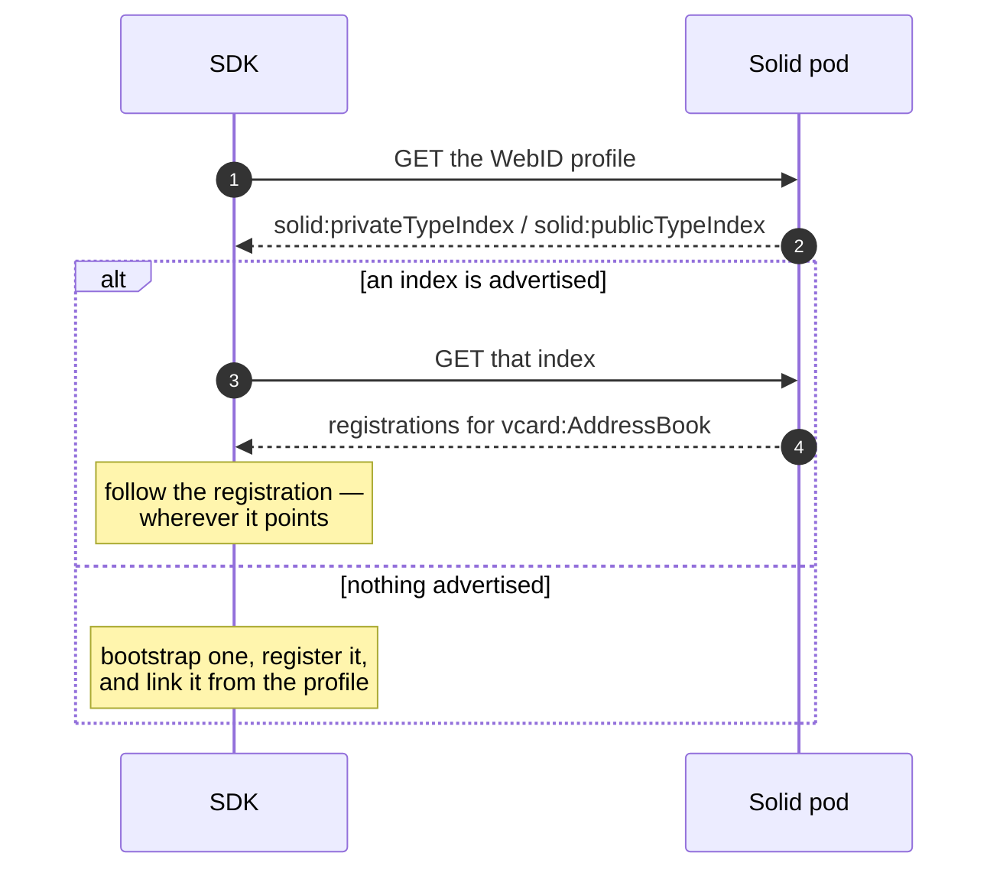

# Type index

A pod has no fixed layout. Contacts are not necessarily at `/contacts/`, and a pod that has been
used by other Solid apps will have them wherever those apps put them. The type index is how
anything gets found: a document that maps *kinds of thing* to *where they live*.

!!! info "There is no public API for this"
    `TypeIndexResolver` is internal. You never call it — the data modules do, on every read and
    write. This page explains what they are doing on your behalf, because it determines whether
    your app finds data that another Solid app wrote.

## Why this matters to you

- **Your app finds data it did not write.** Contacts created in SolidOS show up in your app,
  because both follow the registration rather than a path.
- **You never hard-code a pod path.** A path that works on one pod is wrong on the next.
- **Existing pods keep working.** Books registered under an older root are found where they are;
  nothing is relocated underneath a user.
- **Private and public are a real choice**, and it is the one decision you actually make here.

## What you control

The `isPrivate` flag on every data-module create is the type index surfacing in your API:

```kotlin
contacts.books.create(webId, title = "Conference contacts", isPrivate = true)
```

| `isPrivate` | Registered in | Who can discover it |
|---|---|---|
| `true` (default) | the private type index | only the user |
| `false` | the public type index | anyone who reads their profile |

!!! warning "Public registration is a disclosure"
    It does not grant access to the data — the resource keeps its own access control. It does
    announce that the data **exists**, to anyone who fetches the profile. "This person keeps an
    address book here" is itself information. Default to private unless the user asked to publish.

## How it flows

Every module read starts the same way:



A pod that advertises no index is not an error — the first write provisions one. A pod whose index
is unreadable reads as **empty**, so a listing comes back with nothing rather than failing.

## Errors you'll hit

| What you see | Why | What to do |
|---|---|---|
| Empty lists on a pod that has data | the data was never registered, or the index is unreadable | nothing to fix in your app; the module follows registrations only |
| Data written by your app is invisible to another Solid app | that app looks at a hard-coded path instead of the index | not fixable from here — the other app is not following the spec |
| A book at an old path still resolving | discovery follows registrations, not paths | working as intended |
| Something private turned up in someone else's view | it was created with `isPrivate = false` | recreate it privately; registration is not access, but it is disclosure |

## Under the hood

A Solid pod has no schema and no reserved paths. Nothing says where address books or tickets
live, and two apps that guessed differently would each end up maintaining a private copy of the
same data. The type index is the pod's answer: a document that maps RDF classes —
`vcard:AddressBook`, `schema:Ticket` — to the resources holding their instances. Discovery
therefore follows a *registration*, never a path: the library asks the index where data of a
class is registered and goes wherever the answer points, so a pod that keeps its tickets
somewhere unusual, or registered them through another app entirely, still resolves. A URI is an
identity, not a directory convention.

Everything the library does to an index goes through one internal object, `TypeIndexResolver`
(`api/src/main/java/com/erfangholami/androidsolidservices/api/datamodule/typeindex/TypeIndexResolver.kt:16`),
with the document model in
`Shared/src/main/java/com/erfangholami/androidsolidservices/shared/model/typeindex/`. The
[data modules](../project/adding-a-data-module.md) are its main customer: every collection bootstrap ends in a
registration, and every collection lookup starts from one.

<details class="info" markdown id="pod-shape">
<summary>Pod shape</summary>


A pod carries two indexes with different audiences:

| Index | Document types | Profile link | Audience |
|---|---|---|---|
| Private | `solid:TypeIndex`, `solid:UnlistedDocument` | `solid:privateTypeIndex` | The owner; access-controlled |
| Public | `solid:TypeIndex`, `solid:ListedDocument` | `solid:publicTypeIndex` | Anyone; advertises what the pod holds |

The links hang off the WebID subject. After a bootstrap, the profile document that
`foaf:isPrimaryTopicOf` points at carries:

```turtle
@prefix solid: <http://www.w3.org/ns/solid/terms#> .

# https://alice.pod/profile/card
<https://alice.pod/profile/card#me>
    solid:privateTypeIndex <https://alice.pod/settings/privateTypeIndex> ;
    solid:publicTypeIndex  <https://alice.pod/settings/publicTypeIndex> .
```

An index is a flat set of `solid:TypeRegistration` nodes, one per registration, each minted at
`{indexUri}#{uuid}` (`SettingTypeIndex.kt:67`). Both registration forms, as the library writes
them today:

```turtle
@prefix solid: <http://www.w3.org/ns/solid/terms#> .

<> a solid:TypeIndex, solid:UnlistedDocument .

<#b3f1c0a2-5e77-4a9e-9c0d-2f6d8e4a1b90>
    a solid:TypeRegistration ;
    solid:forClass <https://schema.org/Ticket> ;
    solid:instance <https://alice.pod/datamodule/tickets/index> .

<#4e0a7d19-8c2b-4f6e-b5a3-9d1c6f2e8a47>
    a solid:TypeRegistration ;
    solid:forClass <https://solidshare.app/ns#Share> ;
    solid:instanceContainer <https://alice.pod/solidshare/shares/> .
```

`solid:instance` names one resource that *is* data of the class; `solid:instanceContainer` names
a container whose members are. Both forms are live: data-module collections and contact books
register as instances pointing at their index document (`EntityCollection.kt:73`,
`AddressBookEngine.kt:169`), the sharing bookkeeping container registers as an instance container
(`SharingManagerHelper.kt:126`), and collections found under the older container form are still
read and migrated in place without moving a resource — see
[data modules](../project/adding-a-data-module.md#existing-pods-are-not-relocated-and-that-is-a-decision).

Index documents are created with content type `application/ld+json`
(`TypeIndexResolver.kt:170`); the Turtle above is the same graph as a reader sees it.

#### `settings/` is a default, not a rule

Missing indexes are bootstrapped at `{storage}/settings/privateTypeIndex` and
`{storage}/settings/publicTypeIndex` — the defaults baked into the profile setters at
`Shared/src/main/java/com/erfangholami/androidsolidservices/shared/model/profile/WebId.kt:163`
and `:178`. But resolution always reads the profile first, so a pod whose provider provisioned
`…/settings/privateTypeIndex.ttl` — or any other location — is used exactly where its profile
says. The default applies only to a pod that advertises no index at all.

</details>

<details class="info" markdown id="public-surface">
<summary>Public surface</summary>


`TypeIndexResolver` is `internal`, and that is a decision: apps talk to stores (contacts,
tickets, sharing), and the index is the discovery plumbing beneath them. Keeping the object
internal keeps the registration invariants — idempotence, compare-and-set — in
one place instead of re-proven in every caller. The surface below is what the library's own
modules use.

#### `TypeIndexResolver` — the verbs

| Verb | What it does |
|---|---|
| `getPrivateTypeIndex(rm, webId)` | The private index document, resolved through the profile and bootstrapped if absent. |
| `getPublicTypeIndex(rm, webId)` | The same for the public index. |
| `addInstance(rm, webId, forClass, instanceUri, isPrivate)` | Registers an instance in the chosen index; a no-op when already registered. |
| `addInstanceContainer(rm, webId, forClass, containerUri, isPrivate)` | The container form of the same registration. |
| `removeResource(rm, webId, resourceUri)` | Drops the registration pointing at the resource — private index first, public only if the private one had none. |

Callers today: `PodCollections.registeredInstances` / `registeredContainers`
(`api/src/main/java/com/erfangholami/androidsolidservices/api/datamodule/core/PodCollections.kt:90`),
`EntityCollection.ensureIndex` (`EntityCollection.kt:73`, `:81`), the contacts engine on book
create and delete (`AddressBookEngine.kt:169`, `:97`), `ContactsPodAccess.kt:49`, and
`SharingManagerHelper.kt:126`.

#### `SettingTypeIndex` — the document model

`Shared/src/main/java/com/erfangholami/androidsolidservices/shared/model/typeindex/SettingTypeIndex.kt:19`
is the public, abstract in-memory index; `PrivateTypeIndex` and `PublicTypeIndex` differ only in
the typing their `setTypes()` stamps — and they stamp it only when the document subject has no
type triples yet, so reading an existing index never rewrites how it was typed.

| Member | Behaviour |
|---|---|
| `getInstances(forClass)` / `getInstanceContainers(forClass)` | All registered URIs of that form for the class. |
| `addInstance` / `addInstanceContainer` | Mints `{index}#{uuid}` and adds the three registration triples. |
| `containsResource(uri)` | True when the URI appears as *any* object — the resource is found regardless of the class it was registered under. |
| `removeResource(uri)` | Removes the whole registration node: the `rdf:type`, `solid:forClass` and pointer triples go together (`SettingTypeIndex.kt:95`). |

</details>

<details class="info" markdown id="how-it-flows">
<summary>How it flows</summary>


#### Resolving an advertised index

1. The WebID document is read and its `solid:privateTypeIndex` / `solid:publicTypeIndex` link
   taken if present (`TypeIndexResolver.kt:142`).
2. Otherwise the extended profile is read — the first `foaf:isPrimaryTopicOf` document, or the
   WebID document again when there is none — and the link taken from there (`:151`).
3. A found link ends resolution. The URI is used as-is, wherever it points.

Only `foaf:isPrimaryTopicOf` is followed at this step. `rdfs:seeAlso` documents are consulted
for storage discovery but not for index links.

#### Bootstrapping when no index is advertised

1. A storage root is resolved: the profile's first `pim:storage`, else
   `StorageDiscovery.discover` — which also reads the primary-topic and `seeAlso` documents,
   then walks up the URI hierarchy probing `HEAD` for a `pim:Storage` ancestor
   (`TypeIndexResolver.kt:220`,
   `api/src/main/java/com/erfangholami/androidsolidservices/api/resource/implementation/StorageDiscovery.kt:10`).
2. The default URI is derived and set on the in-memory extended profile
   (`WebId.setPrivateTypeIndex`, `TypeIndexResolver.kt:158`).
3. The link is written into the extended profile document with a single-triple N3 Patch
   **insert** — never a full-document PUT, because the profile is shared real estate other apps
   write too (`:229`).
4. `ensureContainer` creates `settings/` bottom-up (`:240`).
5. The empty, typed index document is created. `CONFLICT` is swallowed: another client creating
   it first is a success, and its document is what subsequent reads return (`:208`).

Every verb resolves this way, including the plain getters — `getPrivateTypeIndex` on a virgin
pod returns having left it with a linked, existing index.

#### Registering and removing

Every mutation runs under `casUpdate`
(`api/src/main/java/com/erfangholami/androidsolidservices/api/resource/implementation/ConditionalUpdate.kt:16`):
read a fresh copy, apply the change in memory, write back under `If-Match` (falling back to
`If-Unmodified-Since` when the server sends no ETag), and on 412 re-read and retry with backoff,
up to four attempts. Two apps registering concurrently both land — the loser of the race retries
on top of the winner's document instead of clobbering it.

Registration is idempotent by inspection, not by convention: when the URI is already registered
the mutation returns `false` and `casUpdate` skips the write entirely (`TypeIndexResolver.kt:47`),
so re-running a bootstrap costs a read, never a write.

`removeResource` tries the private index first and stops as soon as a registration was dropped
there; only then does it touch the public one (`:66`). An index the profile does not advertise
is skipped rather than bootstrapped — `findTypeIndexUri` returns `null` (`:119`) — because
creating an index in order to remove nothing from it would be pointless work on someone else's
pod.

</details>

<details class="info" markdown id="failure-behaviour">
<summary>Failure behaviour</summary>


- **No storage, no bootstrap.** When neither the profile nor discovery yields a `pim:storage`,
  the resolver throws an `IllegalStateException` naming the WebID (`TypeIndexResolver.kt:227`)
  rather than allocating an index at a guessed location — the same stance as `requireStorage` in
  the data modules.
- **Registration races are retried.** A 412 inside `casUpdate` re-reads and retries; after four
  attempts the failure surfaces instead of looping forever.
- **Bootstrap create races are tolerated narrowly.** Only `CONFLICT` is treated as "someone got
  there first" (`:216`). A server that reports the same race as `PRECONDITION_FAILED` surfaces
  it — narrower than the collection-index create, which swallows both
  (`EntityCollection.kt:150`).
- **A dangling link is not repaired.** Bootstrap triggers on a missing *link*, not a missing
  document. When the profile advertises an index that then 404s, every verb fails with
  `NOT_FOUND` rather than silently minting a replacement — a replacement would not carry the
  registrations other apps believe exist.
- **Failures are exceptions here.** Every hop calls `getOrThrow()`; the resolver has no
  `SolidResult` surface of its own. The module engines that call it re-wrap at their own result
  boundary (`solidCatching` at `AddressBookEngine.kt:91`).

</details>

<details class="info" markdown id="extension-points">
<summary>Extension points</summary>


- **A new data module never touches the resolver.** It states its class in
  `CollectionSpec.registeredTypeIri` and inherits registration and lookup from
  the toolkit — see [data modules](../project/adding-a-data-module.md#adding-a-module).
- **Public registration is one boolean.** Both add verbs take `isPrivate`; the contacts engine
  passes it through from `createBook` (`AddressBookEngine.kt:139`), so an advertised, publicly
  discoverable address book costs a flag, not a code path.
- **A custom index location needs no hook.** Resolution reads the profile first and any existing
  link wins, so pointing `solid:privateTypeIndex` somewhere else is honored automatically.
- **Direct reads are open.** `SettingTypeIndex` and its subclasses are public in `Shared`, so a
  consumer holding a `SolidResourceManager` can read an index as `PrivateTypeIndex::class.java`
  and query it; the data modules expose the flattened view as `registeredInstances` /
  `registeredContainers`.

</details>

<details class="info" markdown id="tests">
<summary>Tests</summary>


`api/src/test/java/com/erfangholami/androidsolidservices/api/datamodule/typeindex/TypeIndexResolverTest.kt`
pins the decisions. Its fixture, `VersionedIndexPod`, versions the index with ETags and exposes a
`beforeUpdate` hook that injects a competing registration mid-flight, so the race is real rather
than simulated. The pins: a registration racing another app's keeps both — the update carries
`If-Match`, the 412 is retried, and the other app's registration survives; re-registering an
already-registered instance writes nothing; removing an unregistered resource writes nothing;
bootstrapping tolerates another app creating the index first (409 on create still yields the
index); and bootstrapping registers the profile link via exactly one PATCH targeting the profile
document, with no full-document PUT.

The toolkit-level behaviour on top — allocate under `datamodule/`, register, reuse, migrate the
registration path — is pinned in `EntityCollectionTest` against
`InMemoryPodResourceManager`, whose `inMemoryPod(…)` seeds both type indexes; see
[data modules](../project/adding-a-data-module.md#tests).

</details>

<details class="info" markdown id="specifications">
<summary>Specifications</summary>


- [Solid WebID Profile](https://solid.github.io/webid-profile/) — the
  `solid:privateTypeIndex` / `solid:publicTypeIndex` links and the extended-profile documents
  they may live in. The draft also allows the private link to live in the `pim:preferencesFile`;
  the resolver reads the WebID document and its `foaf:isPrimaryTopicOf` extension only, so a
  link kept solely in the preferences file is not found and a fresh index is bootstrapped beside
  it. Named here so a reader can tell the omission from a decision: it is a decision, revisited
  if a pod in the wild turns up that keeps the link nowhere else.
- [Solid type index](https://github.com/solid/type-indexes) — `solid:TypeRegistration`,
  `solid:forClass`, the `solid:instance` / `solid:instanceContainer` forms, and the
  `solid:ListedDocument` / `solid:UnlistedDocument` split this page describes.
- [Solid Protocol](https://solidproject.org/TR/protocol) — N3 Patch, which carries the
  profile-link insert, and the conditional-request semantics `casUpdate` builds on.


</details>