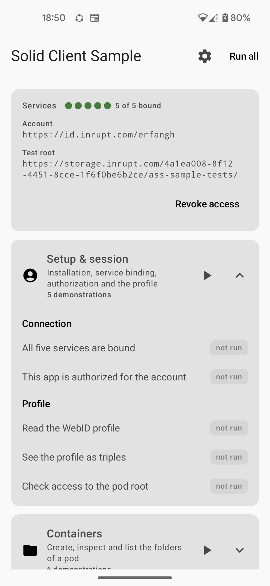

# Android Solid Services

**Single sign-in to [Solid](https://solidproject.org/) for Android.**
[Solid Share](https://solidshare.app) holds the user's pod accounts. Every other app on the
device reaches those pods through it — with a grant the user scoped, and without ever handling a
credential.

For your app, that is one dependency and no authentication code at all.

<div class="grid cards" markdown>

-   :material-rocket-launch-outline: **[Quickstart](start/quickstart.md)**

    ---

    Sign a user in and write to their pod, in about ten minutes.

-   :material-help-circle-outline: **[Client or API?](start/client-or-api.md)**

    ---

    The one decision to make up front. Takes a minute.

-   :material-toolbox-outline: **[Build with it](build/index.md)**

    ---

    Contacts, sharing, resources, notifications — one page each.

-   :material-cellphone-arrow-down: **[Install Solid Share](start/install-app.md)**

    ---

    The host app. For people who just want Solid on their phone.

-   :material-arrow-up-bold-circle-outline: **[Upgrade guide](project/upgrading.md)**

    ---

    Already using an older version? The route to 0.8.0, from wherever you are.

</div>

## The problem

Solid gives people their own data. But on Android, every app that wants to use a pod has to
become an identity client in its own right: run the OIDC flow, mint and rotate DPoP tokens, store
them safely — and then the next app does all of it again.

The user signs in separately in each app. Each app's mistakes with those credentials are its own
to make.

## How this solves it

Solid Share owns the login. Tokens are DPoP-bound to keys generated in the Android Keystore,
encrypted at rest, and they never leave that app. Other apps talk to it over AIDL and get
**results**, never credentials.

The user signs in once, and decides for each app what it may do and where — the whole pod, a few
folders, or one data module — at View, Add, Edit or Full access. They can narrow or revoke it at
any time.

```kotlin
// The whole of your authentication code.
val authorize = registerForActivityResult(
    AuthorizeWithSolid(
        AccessRequest(level = AccessLevel.EDIT, targets = listOf(RequestedTarget.Path("notes/"))),
    ),
) { result ->
    if (result is SolidSignInResult.Authorized) onSignedIn(result.webId, result.grant)
}
```

## What you get

<div class="grid" markdown>

:material-account-multiple-outline: **Several accounts at once**
{ .card }

Accounts from different pod providers, all signed in, all usable. Every call names the WebID it is
for, so routing is explicit.

:material-shield-key-outline: **Access the user scopes**
{ .card }

Ask for a level on the whole pod, on folders, or on a data module. Every verb is checked against
what the user approved, and they can narrow it later.

:material-share-variant-outline: **Sharing that pods understand**
{ .card }

View / Add / Edit access over Web Access Control or Access Control Policy, share links, and a
Linked Data Notifications inbox for offers and requests.

:material-database-outline: **Data modules, not just bytes**
{ .card }

Contacts and tickets as standard RDF, laid out so other Solid apps read the same data.

</div>

## The pieces

| Component | Role | Published |
|---|---|---|
| [Solid Share](https://solidshare.app) | The app that holds the accounts and hosts the IPC services | [Google Play](https://play.google.com/store/apps/details?id=com.erfangholami.solidshare) · [F-Droid](https://f-droid.org/packages/com.erfangholami.solidshare/) |
| [`client`](start/client-or-api.md) | For apps that go through Solid Share | [Maven Central](https://central.sonatype.com/artifact/com.erfangholami.androidsolidservices/client) |
| [`api`](start/client-or-api.md) | For apps that talk to pods directly | [Maven Central](https://central.sonatype.com/artifact/com.erfangholami.androidsolidservices/api) |
| `host` | For apps that host the services themselves, as Solid Share does | [Maven Central](https://central.sonatype.com/artifact/com.erfangholami.androidsolidservices/host) |

There is also a [sample app](https://github.com/erfangholami/Android-Solid-Service_client-sample)
that runs every SDK call against a live pod, each shown beside the code that made it — the fastest
way to watch a call behave before you write it.

<figure markdown>
{ width="320" }
<figcaption>The sample app, bound to all five services and ready to run its catalogue against a live pod.</figcaption>
</figure>

## New to Solid?

[Solid](https://solidproject.org/) is an open standard, led by Sir Tim Berners-Lee, that puts
people in control of their own data. Instead of living inside an app's servers, your data lives in
a **pod** you own. Apps ask for permission to read or write it, and you can withdraw that
permission at any time.

The result is that data and applications come apart: you can switch apps without losing anything,
and two apps can use the same data without copying it between them.

## Questions, bugs, contributions

Please [open an issue](https://github.com/erfangholami/Android-Solid-Services/issues) — including
compatibility reports against a particular pod server, which have led to several fixes.
[Contributing](project/contributing.md) covers building from source.

## Acknowledgments

Funded by [NLnet](https://nlnet.nl/).
