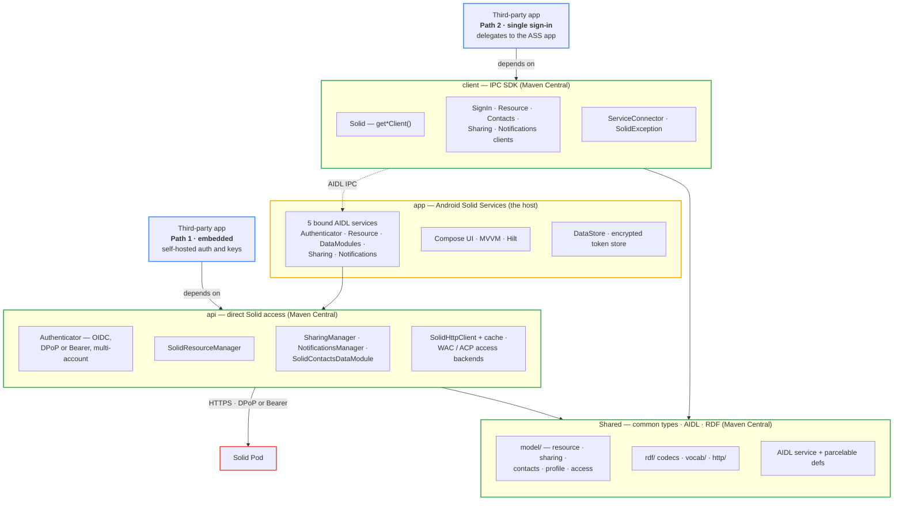
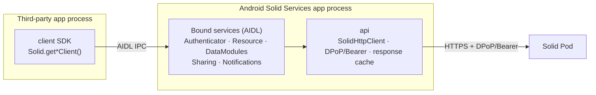

# Architecture

## Modules and Integration Paths

Four Gradle modules in a layered chain. `Shared` holds the common types; `api` and `client` both build
on it; the `app` (the host) bundles both. Three of the four — `Shared`, `api`, and `client` — are
published to Maven Central, so a third-party app can integrate along **either of two paths**:

- **Path 1 — embedded (`api`):** depend on `api` and reach the Solid pod **directly**, performing your
  own login and signing every request in-process. Self-contained — no ASS app needs to be installed,
  but your app manages its own credentials and keys.
- **Path 2 — single sign-in (`client`):** depend on `client` and delegate over **AIDL IPC** to the
  installed ASS app, which holds the credentials and talks to the pod for you. One shared login across
  every Solid app on the device, and no token handling in your app.



Both paths run the **same `api` engine** against the pod — the difference is *where* it runs: in the
third-party app's own process (Path 1), or inside the ASS app's process behind AIDL (Path 2). `api`
and `client` each depend on `Shared`; the `app` depends on both.

Package roots: `app` → `com.erfangholami.androidsolidservices`, with `…api`, `…client`, and
`…shared` for the three libraries.

---

## IPC: How Apps Communicate

Apps that take the single-sign-in path (`client`) **never talk directly to the Solid pod**. They bind to one of the AIDL services in the ASS app, which uses the `api` module to reach the pod over authenticated HTTPS. (Apps on the embedded path link `api` and make these same calls in-process.)



Each `client` entry point binds to its matching bound service:

| `client` entry point             | Bound service             | Responsibility                          |
|----------------------------------|---------------------------|-----------------------------------------|
| `Solid.getSignInClient()`        | `ASSAuthenticatorService` | Login, access grants                    |
| `Solid.getResourceClient()`      | `ASSResourceService`      | CRUD on pod resources                   |
| `Solid.getContactsDataModule()`  | `SolidDataModulesService` | Contacts, address books                 |
| `Solid.getSharingClient()`       | `ASSSharingService`       | Shares, access grants *(0.5.0)*         |
| `Solid.getNotificationsClient()` | `ASSNotificationsService` | LDN inbox *(0.5.0)*                      |

Each service is an Android **bound service**. The client libraries expose `Flow<Boolean>` connection state so apps can react to connect/disconnect events in real time.

AIDL interface definitions (both parcelable types and service contracts) live in `Shared/src/main/aidl/`.

---

## Authentication: OpenID Connect (DPoP or Bearer)

The auth flow uses the **AppAuth** library (`net.openid:appauth`) for the OpenID Connect code exchange. Token binding is **negotiated** from the provider's discovery document: if it advertises DPoP (Demonstration of Proof-of-Possession) support via `dpop_signing_alg_values_supported`, ASS uses DPoP; otherwise it falls back to standard **Bearer** tokens.

1. User enters their WebID or selects an OpenID provider.
2. ASS resolves the OIDC issuer from the WebID document.
3. A browser intent opens the provider's login page.
4. The provider redirects back to ASS with an authorization code.
5. ASS exchanges the code for access + refresh tokens.
6. Every subsequent pod request carries an `Authorization: <DPoP|Bearer> <token>` header; when DPoP was negotiated, a freshly signed DPoP proof is attached as well — binding the token to the request and preventing replay.

When DPoP is in effect, each account has its **own DPoP key pair** in the Android Keystore. Multi-account state (profiles, tokens) is persisted with **DataStore**, **encrypted at rest** (AES-256-GCM via an Android Keystore key). Login can use either dynamic client registration or a hosted **Solid-OIDC Client ID Document** (`clientId`). Token refresh is nonce-aware (per-origin DPoP nonces, retry on `use_dpop_nonce`) and resilient — a recoverable failure no longer forces a re-login.

---

## Module Breakdown

### Shared (`com.erfangholami.androidsolidservices.shared`)

Common types shared across all modules. Published implicitly as a transitive dependency. Since 0.5.0
it is organized into intent-based packages (`model/`, `rdf/`, `http/`, `result/`, `error/`, `util/`,
`vocab/`), and its public API exposes only plain types — a `String` content-type and a `SolidHeaders`
value type rather than okhttp / titanium-json-ld types (the JSON-LD codec is an internal dependency).

| Area              | Contents                                                                                              |
|-------------------|-------------------------------------------------------------------------------------------------------|
| Resource model    | `Resource` → `RDFResource` / `NonRDFResource` → `SolidRDFResource` / `SolidNonRDFResource` / `SolidContainer` (with `size` / `createdTime` / `lastModified` accessors since 0.5.0) |
| Result types      | `SolidResult<T>` (sealed: `Success`, `Failure`) with typed `SolidError`, `SolidHeaders`, `HTTPConstants` |
| Data module types | `AddressBook`, `AddressBookList`, `Contact`, `SolidContact`, `SolidContactList`, `ContactData`, `FullGroup`, `NewTicket`, `Ticket`, `TicketList` |
| Sharing types     | `GivenShare`, `ReceivedShare`, `ShareMode`, `ShareReceiver`, `AccessGrant`, `CatalogEntry`, `ShareNotification`, `ShareRequest` (0.5.0) |
| Patch type        | `N3Patch` — type-safe DSL and diff factory for [Solid N3 Patch](https://solidproject.org/TR/protocol#n3-patch) documents |
| Vocabulary        | `LDP`, `VCARD`, `ACL`, `ACP`, `OWL`, `DC`, `RDFS`, `Solid` constants                                  |
| AIDL parcelables  | Parcelable wrappers for cross-process data transfer (all definitions consolidated here)               |

### api (`com.erfangholami.androidsolidservices.api`)

Direct Solid server communication. Used internally by the ASS app and available as a standalone library.

| Class                                                               | Role                                       |
|---------------------------------------------------------------------|--------------------------------------------|
| `Authenticator` / `AuthenticatorImplementation`                     | OIDC auth (DPoP or Bearer), multi-account, Client ID Document |
| `SolidResourceManager` / `SolidResourceManagerImplementation`       | CRUD on pod resources (+ `head`/`patch`/`createInContainer`) |
| `SolidContactsDataModule` / `SolidContactsDataModuleImplementation` | Contacts data module                       |
| `SharingManager` / `SharingManagerImplementation`                   | Resource sharing — WAC/ACP grants, index, share links (0.5.0) |
| `NotificationsManager` / `NotificationsManagerImplementation`       | LDN inbox — offers, requests, accept/reject (0.5.0) |
| `AccessBackend` (`WacBackend` / `AcpBackend`)                       | Internal access-control writers behind sharing (0.5.0) |
| `SolidHttpClient` / `SolidResponseCache`                            | OkHttp-based Solid HTTP client + in-memory response cache (0.5.0) |
| `DPoPGenerator`                                                     | Signs DPoP proof JWTs when the provider supports DPoP (per-account keys) |

### client (`com.erfangholami.androidsolidservices.client`)

IPC client library. No direct pod access — all calls are proxied through the ASS app.

| Class                      | Role                                                                               |
|----------------------------|------------------------------------------------------------------------------------|
| `Solid`                    | Entry point: `getSignInClient()`, `getResourceClient()`, `getContactsDataModule()`, `getSharingClient()`, `getNotificationsClient()` |
| `SolidSignInClient`        | Auth IPC client                                                                    |
| `SolidResourceClient`      | Resource CRUD IPC client (`head`/`patch`/`update(ifMatch)` since 0.5.0)            |
| `SolidContactsDataModule`  | Contacts IPC client                                                                |
| `SolidSharingClient`       | Resource sharing IPC client (0.5.0)                                                |
| `SolidNotificationsClient` | LDN inbox IPC client (0.5.0)                                                       |
| `ServiceConnector`         | Shared, self-healing AIDL bind/callback plumbing (0.5.0)                           |
| `SolidException` hierarchy | Typed exceptions for all failure modes                                             |

### app (`com.erfangholami.androidsolidservices`)

The host application. Users interact with this; third-party apps bind to its services.

| Area           | Technology                                                                 |
|----------------|----------------------------------------------------------------------------|
| UI             | Jetpack Compose, Navigation Compose                                        |
| Architecture   | MVVM, ViewModel, Kotlin StateFlow                                          |
| DI             | Hilt                                                                       |
| Services       | `ASSAuthenticatorService`, `ASSResourceService`, `SolidDataModulesService`, `ASSSharingService`, `ASSNotificationsService` |
| Persistence    | DataStore + Protocol Buffers (access grants, profiles); token store encrypted at rest (AES-256-GCM, Android Keystore) |
| Auth           | `net.openid:appauth` (OIDC) + DPoP or Bearer tokens                        |
| Solid protocol | Custom `SolidHttpClient` (OkHttp-based; Inrupt Java Client removed)        |

---

## Technology Summary

| Technology                     | Version / Notes                              |
|--------------------------------|----------------------------------------------|
| Kotlin                         | Coroutines, Flow, serialization              |
| Jetpack Compose                | UI — no XML views                            |
| Hilt                           | Dependency injection (app module only)       |
| AIDL                           | Cross-process communication                  |
| AppAuth (`net.openid:appauth`) | OpenID Connect                               |
| `SolidHttpClient`              | Custom OkHttp-based Solid HTTP client (replaces Inrupt Java Client SDK); in-memory response cache since 0.5.0 |
| Titanium JSON-LD               | RDF, JSON-LD parsing (internal `implementation` dependency — off the public API surface since 0.5.0) |
| DataStore                      | Local persistence (Preferences + a kotlinx.serialization JSON `Serializer`); token store encrypted at rest (AES-256-GCM, Android Keystore) since 0.5.0 |
| kotlinx.serialization          | JSON serialization (replaced Gson in v0.3.0) |
| Min SDK                        | 26 (Android 8.0)                             |
| Target / Compile SDK           | 36 / 37                                      |
| JVM target                     | 17                                           |

## Monitoring

Android Solid Services reports crashes and performance data through Firebase Crashlytics and
Firebase Performance Monitoring. The app carries the Firebase dependency; the three published
libraries do not.

### Why the libraries stay Firebase-free

`api`, `client` and `shared` are published to Maven Central and are compiled into third-party
applications. Making them depend on Firebase would force every consumer to add a Firebase project
and a `google-services.json`, and would route SDK telemetry into *their* Firebase project — a poor
fit for an SDK whose whole purpose is keeping personal data under the user's control.

Instead the libraries emit through a small interface in `shared.telemetry`:

```
libraries  ──emit──▶  Telemetry (facade)  ──▶  TelemetrySink
                                                    │
                          no sink installed ────────┤──▶ no-op, nothing collected
                          app installs bridge ──────┴──▶ FirebaseTelemetrySink
```

Nothing is collected or transmitted until a host application calls `Telemetry.install(...)`. The
libraries add no monitoring dependency of any kind.

### What is reported

| Signal | Source | Destination |
| --- | --- | --- |
| Uncaught crashes | Whole app process, incl. binder threads | Crashlytics |
| Swallowed data-module exceptions | `AidlDispatch.dispatchDataModule` | Crashlytics (non-fatal) |
| Non-transport request faults | `SolidHttpClient.solidFailure` | Crashlytics (non-fatal) |
| Transport failures (offline, reset) | `SolidHttpClient.solidFailure` | Crashlytics breadcrumb only |
| Terminal token-refresh failures | `TokenRefreshCoordinator` | Crashlytics (non-fatal) + `solid_auth_refresh` trace |
| HTTP request timing | `SolidHttpClient.send` | Performance (network span) |
| IPC bind latency and binder deaths | `client` `ServiceConnector` | Performance + breadcrumbs |
| App start, screen rendering | Firebase SDK | Performance |

A dropped connection is a fact of mobile life, not a defect, so `IOException` is recorded as a
breadcrumb rather than a non-fatal. That keeps a device going offline from generating hundreds of
identical Crashlytics reports while still leaving the context attached to whatever is reported next.

### Attributing failures to the integrating app

Every report carries a `calling_app` custom key naming the application whose IPC call was being
serviced, or `self` when the work started in the ASS UI. `CallerAttribution.currentCaller()` reads
`Binder.getCallingUid()` and resolves it through `PackageManager`, caching successful lookups.

The read happens in `beginAttributedCall()` **before** `launch`, because a caller's identity is only
visible while the binder transaction is still on the stack — by the time the coroutine runs,
`getCallingUid()` reports the ASS process itself. `dispatchDataModule` carries the resolved name into
its closure and attaches it to the report directly.

Note that Crashlytics custom keys are process-global, so under genuinely concurrent calls from two
different apps the `calling_app` key on a deep `api` non-fatal reflects the most recent caller rather
than the one that failed. The per-report attribute on `dispatchDataModule` is exact.

### Privacy

A Solid pod URL's path names the user's containers and resources, so no path ever reaches Firebase.

- **Manual network spans report the origin only** — `scheme://host[:port]`, via
  `URI.telemetryOrigin()` in `api/http/TelemetryOrigin.kt`. This is enough to break latency down per
  pod provider without describing what the user stores there.
- **Automatic Performance instrumentation is disabled.** The Firebase Performance Gradle plugin
  rewrites bytecode to trace every OkHttp call with its complete URL, which would defeat the above.
  `firebasePerformanceInstrumentationEnabled=false` in `gradle.properties` turns that off. App-start
  and screen-render traces are SDK-side and unaffected; `@AddTrace` is also disabled by this flag.
- **No Firebase Analytics.** Crashlytics breadcrumb-from-Analytics integration is not wired up.
- WebIDs, pod resource paths, tokens and refresh-token fingerprints are never sent as attributes.

### Release only

Collection is a **release-build feature**. Debug builds initialise Firebase but gather nothing:

| | `debug` | `release` |
| --- | --- | --- |
| `firebase_crashlytics_collection_enabled` (manifest) | `false` | `true` |
| `firebase_performance_collection_enabled` (manifest) | `false` | `true` |
| `BuildConfig.TELEMETRY_ENABLED` | `false` | `true` |
| `Telemetry` sink installed | no — stays no-op | `FirebaseTelemetrySink` |

The manifest flags are the Firebase SDKs' own switches, so nothing is gathered in the window before
`Application.onCreate` runs. `installFirebaseTelemetry` then re-asserts both settings from
`TELEMETRY_ENABLED` — they persist across launches and the two build types share an `applicationId`,
so it sets them explicitly rather than trusting what a previous install left behind — and installs
the sink only when enabled.

To collect from a debug build temporarily, flip the `debug` block in `app/build.gradle.kts`:

```kotlin
debug {
    manifestPlaceholders["crashlyticsEnabled"] = true
    manifestPlaceholders["performanceEnabled"] = true
    buildConfigField("boolean", "TELEMETRY_ENABLED", "true")
}
```

### Setting up Firebase

`app/google-services.json` must be present and must register an Android app with package name
`com.erfangholami.androidsolidservices` — the `google-services`, `crashlytics` and `firebase-perf`
plugins are applied unconditionally and the build fails without it. Download it from the
[Firebase console](https://console.firebase.google.com/) into `app/`.

#### Release builds upload the R8 mapping

`assembleRelease` runs `uploadCrashlyticsMappingFileRelease`, which sends `mapping.txt` to Firebase
so release stack traces deobfuscate. It needs network access. To build a release without uploading:

```sh
./gradlew :app:assembleRelease -x uploadCrashlyticsMappingFileRelease
```

`app/proguard-rules.pro` keeps `SourceFile,LineNumberTable`, which Crashlytics needs to
symbolicate, and `-keepnames` the SDK's own exception classes, which is how Crashlytics groups
non-fatals by type.

### Plugging in your own backend

Third-party apps embedding the `client` SDK can capture the same signals without Firebase by
implementing `TelemetrySink`:

```kotlin
class SentryTelemetrySink : TelemetrySink {
    override fun startSpan(name: String): TelemetrySpan = /* … */
    override fun startNetworkSpan(url: String, method: String): TelemetryNetworkSpan = /* … */
    override fun recordException(throwable: Throwable, attributes: Map<String, String>) {
        Sentry.captureException(throwable)
    }
    override fun log(message: String) = Sentry.addBreadcrumb(message)
    override fun setKey(key: String, value: String) = Sentry.setTag(key, value)
}

class MyApplication : Application() {
    override fun onCreate() {
        super.onCreate()
        Telemetry.install(SentryTelemetrySink())
    }
}
```

`Telemetry` isolates sink failures: an exception thrown by a sink is swallowed rather than
propagated into SDK code, so a broken backend can never break a pod operation.

#### What the SDK author can and cannot see

| Integration | Where the code runs | Visible in the ASS Firebase console |
| --- | --- | --- |
| `client` + ASS app installed | `client` in the integrator's process; **`api` in the ASS process** | Yes for everything `api` does, tagged with `calling_app`. No for the integrator's own process. |
| `api` embedded directly | Entirely in the integrator's process | **Nothing.** |

There is no supported way to change the second row: `FirebaseCrashlytics.getInstance()` takes no
`FirebaseApp`, so a library cannot report to a Crashlytics project other than its host app's, and
installing an uncaught-exception handler from a library would break the host's own crash reporting.
A library embedded in someone else's app can only report where that app tells it to — which is what
`TelemetrySink` is for.

### Making collection user-consented

Collection currently follows the build type. To put it behind a user opt-in instead, replace the
`BuildConfig.TELEMETRY_ENABLED` reads in `installFirebaseTelemetry` with the stored preference and
re-run it when the preference changes:

```kotlin
crashlytics.setCrashlyticsCollectionEnabled(userOptedIn)
performance.isPerformanceCollectionEnabled = userOptedIn
if (userOptedIn) Telemetry.install(FirebaseTelemetrySink(crashlytics, performance))
else Telemetry.uninstall()
```

`Telemetry.uninstall()` restores the no-op sink, so the libraries go quiet immediately.
