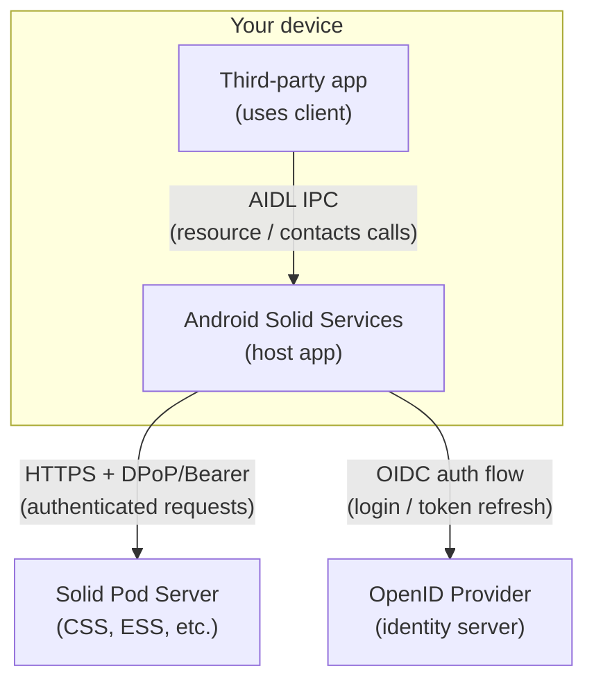
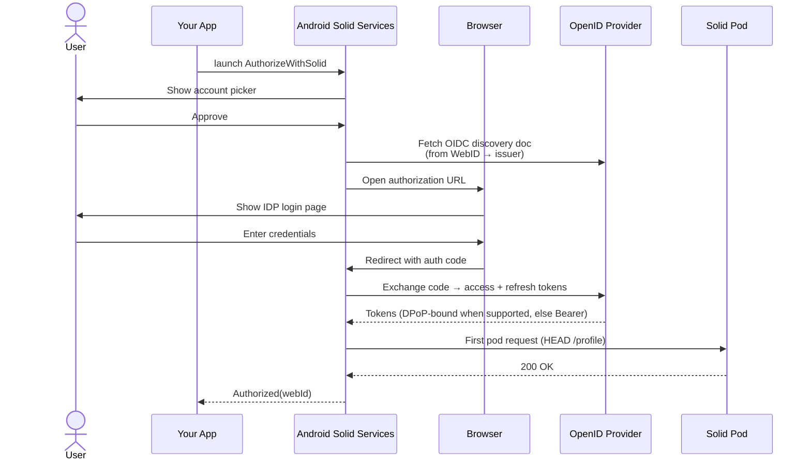
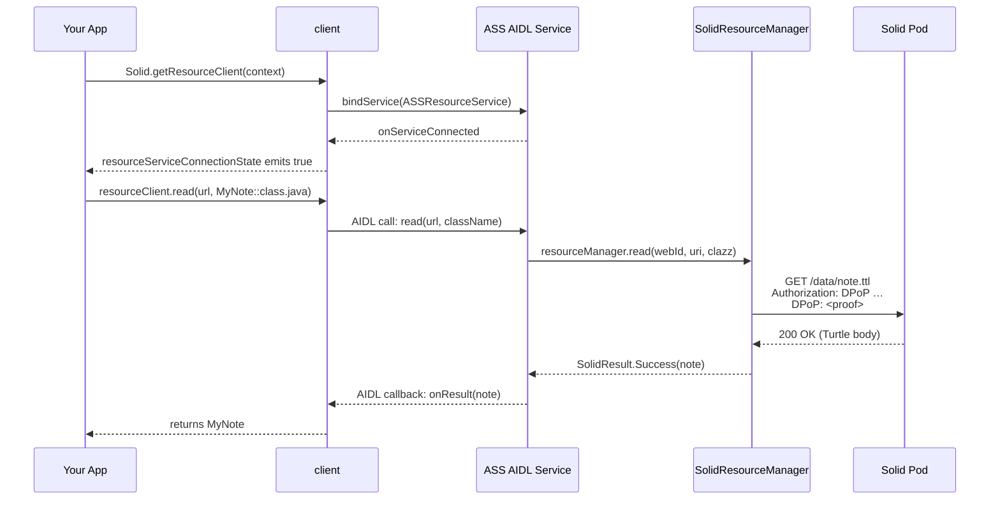
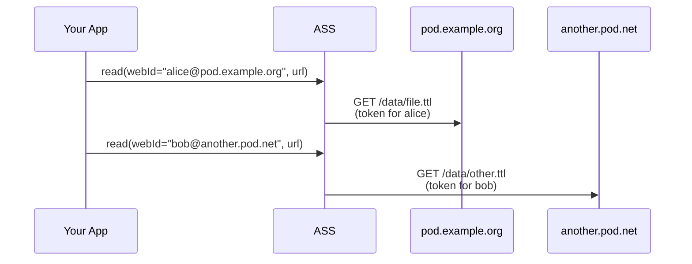
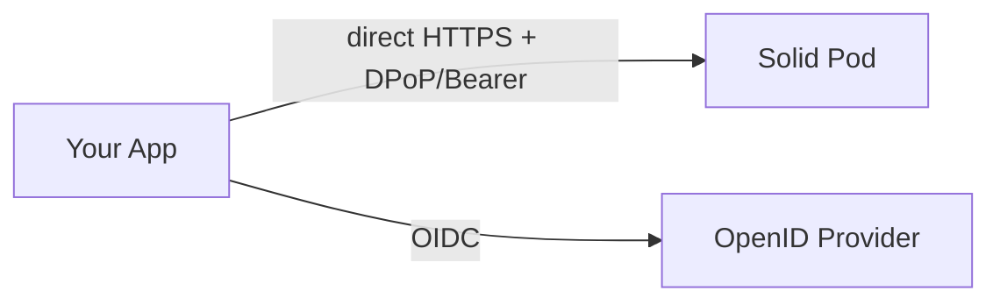
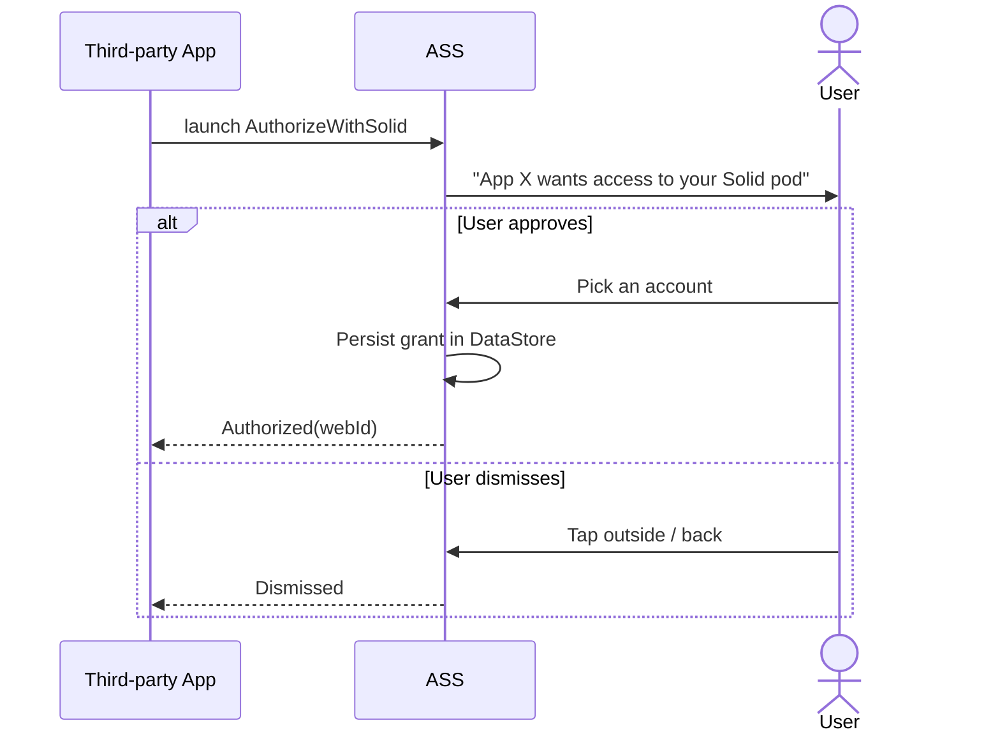
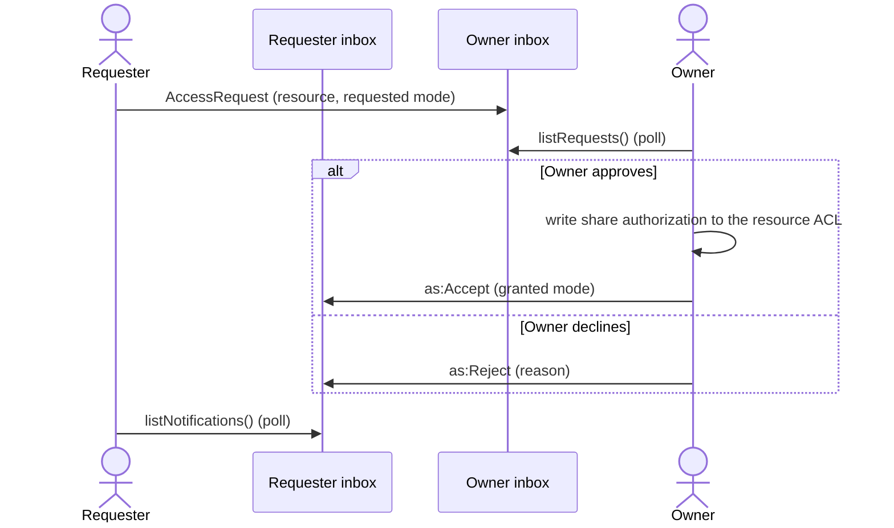

# How It Works

This page walks through how Android Solid Services works at runtime — from a user logging in to a third-party app reading a pod resource. Understanding this helps you build apps that integrate correctly and handle edge cases gracefully.

---

## The Three-Layer Model

Your app **never talks directly to the pod**. It calls the ASS host app over Android IPC (AIDL), which holds the tokens and makes all authenticated HTTP requests on its behalf.

This design has two benefits:

- **Single sign-in** — the user logs in once; every app on the device reuses the same session.
- **Credential isolation** — access tokens never leave the ASS process; third-party apps cannot exfiltrate them.

---

## Authentication Flow

The login flow runs once per Solid account. ASS orchestrates the full OpenID Connect exchange, adding DPoP token binding when the provider supports it:

After login, ASS stores the tokens (access + refresh) in an **encrypted-at-rest** DataStore — AES-256-GCM under an Android Keystore key — so the persisted session is unreadable off-device. When DPoP is in use, each account also has **its own DPoP key pair** held by ASS, so a stolen token is useless without the private key.

!!! tip "Stable client identity (0.5.0)"
    By default ASS registers a client dynamically with each OpenID Provider. You can instead point the login at a hosted **Solid-OIDC Client ID Document** (a stable `client_id` URL) so registration never expires and the consent screen shows your app's real name. See [Using a Client ID Document](../reference/client-id-document.md).

---

## DPoP or Bearer: How Requests Are Authenticated

ASS does not force DPoP. It **negotiates** the token-binding scheme from the OpenID Provider's
discovery document and uses whichever the server supports:

- **DPoP ([Demonstration of Proof-of-Possession](https://datatracker.ietf.org/doc/html/rfc9449))** —
  preferred, and used whenever the provider advertises it (`dpop_signing_alg_values_supported`). Every
  request then carries two headers:

    | Header | Content |
    |--------|---------|
    | `Authorization: DPoP <token>` | The access token issued by the IDP |
    | `DPoP: <proof>` | A short-lived JWT, signed with a private key ASS generated at first launch, binding the token to this specific request (method + URI + timestamp) |

    If the server returns a `DPoP-Nonce` header, ASS incorporates it into the next proof — preventing
    replay attacks.

- **Bearer tokens** — the fallback when the provider does not advertise DPoP. Requests carry a plain
  `Authorization: Bearer <token>` header and no proof.

This negotiation happens automatically; your app doesn't need to know which scheme is in effect.

---

## IPC: How Your App Calls ASS

The `client` library binds to the Android services inside the ASS app — sign-in, resources, contacts, and (since 0.5.0) sharing and notifications:

The `Flow<Boolean>` connection state is essential: AIDL binding is asynchronous. Always collect it before calling methods — or you'll get a `SolidServiceConnectionException`.

---

## Multi-Account Routing

Since v0.3.0, ASS manages multiple logged-in Solid accounts. Since v0.4.0, the client library passes the target WebID on every call so ASS can route the request to the correct token set.

Persist the WebID after login: `signInClient.getAccount(webId)?.webId`, or take it straight from
`SolidSignInResult.Authorized`. Pass it on every subsequent call.

---

## Resource Operations: What Happens Under the Hood

When your app calls `resourceClient.read(url, clazz)`, ASS:

1. Looks up the access token for the given WebID.
2. Refreshes it if expired (using the stored refresh token, plus a fresh DPoP proof when DPoP is in use).
3. Issues a `GET` with the negotiated auth headers — `Authorization: DPoP` + a `DPoP` proof, or a plain `Authorization: Bearer`.
4. Parses the response body (Turtle, JSON-LD, or raw bytes) into your data class.
5. Returns `SolidResult.Success(value)` or `SolidResult.Failure(error)` — never throws.

For `update()` and `patch()`, passing an `ifMatch` ETag from a prior `head()` or `read()` adds conditional write protection: the server rejects the write with `412 Precondition Failed` if someone else changed the resource since you last read it.

---

## Direct API Mode (no host app)

If you use `api` directly (no ASS host app), the flow is the same — but your app owns the auth state:

You call `Authenticator.getInstance(context)` and manage the token lifecycle yourself. Use this when you want a fully self-contained app or when ASS is unavailable.

---

## Access Grant Flow

Before a third-party app can read any resource, ASS requires an explicit grant from the user:

Grants are stored per-app in DataStore and shown in the ASS Settings page. The user can revoke them at any time. Your app can also revoke its own grant by calling `disconnectFromSolid()`.

---

## Sharing & Access Control

Since v0.5.0, ASS can share pod resources with **other people** (distinct from the app access grants
above, which are about which apps may act for you). A share writes an authorization onto the
resource's access control so the receiver's own credentials let them reach it:

- **Backend** — Web Access Control (WAC, `.acl`) or Access Control Policy (ACP, `.acr`). ASS detects
  which the pod uses from the resource's advertised authorization links and writes the right one.
- **Modes** — **View** (`acl:Read`), **Add** (`acl:Read` + `acl:Append`), or **Edit** (`acl:Read` +
  `acl:Write`). WAC has no mode subsumption, so the implied modes are written explicitly and folded
  back into one logical level per receiver when listed.
- **Receivers** — a single WebID, a `vcard:Group` (members inherit), or the public.
- **Containers** — sharing a container uses `acl:default` so its members inherit the access.
- **Index** — ASS keeps a private `given_shares.ttl` / `received_shares.ttl` pair under
  `/solidshare/` so a user can list what they've shared and received without re-walking the pod; it
  can be rebuilt from the pod's own ACLs.
- **Links** — a share can be handed off out-of-band as an `https://solidshare.app/s…` App Link or QR
  code; opening it adds the resource to the receiver's "shared with me" list after verifying access.

## Notifications Inbox

Sharing across pods is coordinated through each user's [Linked Data Notifications](https://www.w3.org/TR/ldn/)
(LDN) inbox. The inbox is advertised on the WebID and granted **public append-but-not-read**: anyone
can POST a notification, but only the owner can read it. The flow is **pull-only** — apps poll the
inbox (e.g. a 15-minute background worker) rather than holding a push connection.

An owner can also push access proactively (`as:Offer`) and later withdraw it (`as:Undo`); the
receiver's next poll updates their received-shares list. Senders are verified cross-pod by reading
their WebID profile anonymously, so a notification can't spoof who it came from.
