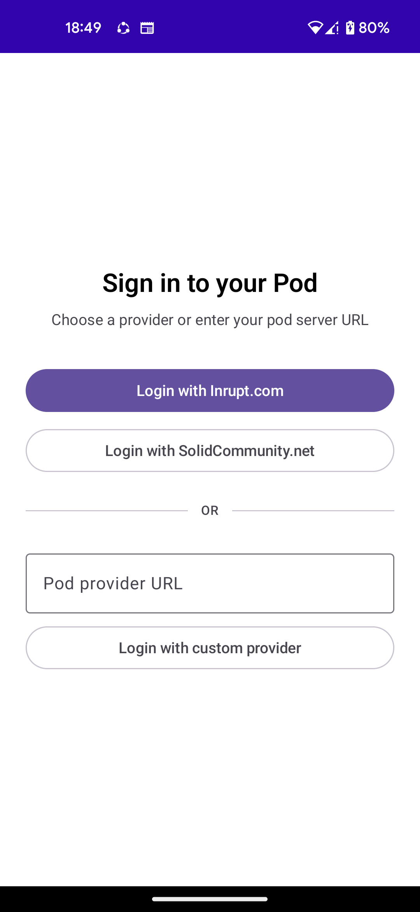
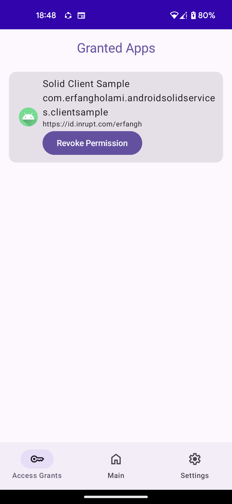

# Install the app

Android Solid Services holds your Solid accounts so every Solid-aware app on your phone can use
them. You install it once.

!!! info "For app developers"
    You need this installed to develop against the `client` library, because that library talks
    to it. If you are building with `api` instead, you do not — see
    [Client or API?](client-or-api.md).

## Get it

Download the latest APK from the
[GitHub Releases page](https://github.com/erfangholami/Android-Solid-Services/releases).
Google Play and F-Droid are in progress.

1. On your Android device, allow **Install from unknown sources** if prompted.
2. Open the downloaded `.apk` and tap **Install**.
3. Launch **Android Solid Services**.

Android 8.0 (API 26) or newer.

## Sign in

Tap **Add account** and pick your pod provider, or type its URL if it is not listed. You are
taken to your provider's own sign-in page — your password is entered there, never in this app.

<figure markdown>
{ width="300" }
<figcaption>Any Solid provider works — the listed ones are shortcuts.</figcaption>
</figure>

You can add several accounts from different providers and keep them all signed in. Apps ask for a
specific one by WebID.

??? question "Which provider do I use?"
    If you do not have a pod yet, [solidcommunity.net](https://solidcommunity.net) and
    [solidweb.org](https://solidweb.org) both hand out free ones. Inrupt's
    [PodSpaces](https://start.inrupt.com) is the commercial option. Any server implementing the
    Solid protocol works.

## Granting apps access

When another app first asks for your pod, Android Solid Services shows you what it wants and
which account it wants it for. Nothing reaches your pod until you allow it.

Review and revoke those grants at any time from **Granted apps** in the app. Revoking is
immediate: the app keeps running, but its calls start failing.

<figure markdown>
{ width="300" }
<figcaption>Each grant names the app and the account it holds access to.</figcaption>
</figure>

Your accounts also appear in Android's **Settings → Accounts**, alongside every other account on
the device. Removing one there signs it out here.

## What leaves your device

Your tokens and signing keys never do. They are generated in the Android Keystore, bound to this
device, and encrypted at rest. Other apps receive the *results* of pod calls, never a credential
they could reuse.

See the [Privacy Policy](../project/privacy.md) for the full account, and
[Troubleshooting](../project/troubleshooting.md) if sign-in misbehaves.
